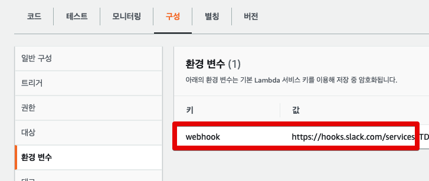
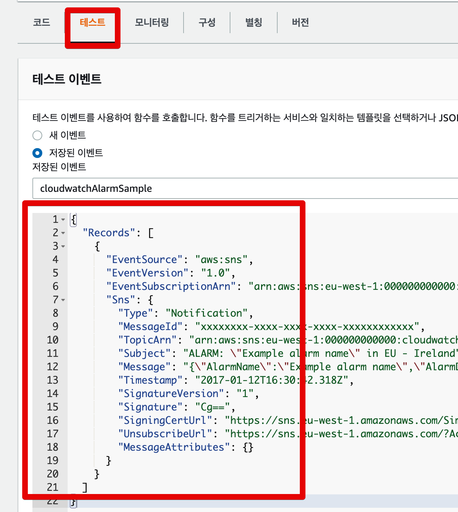
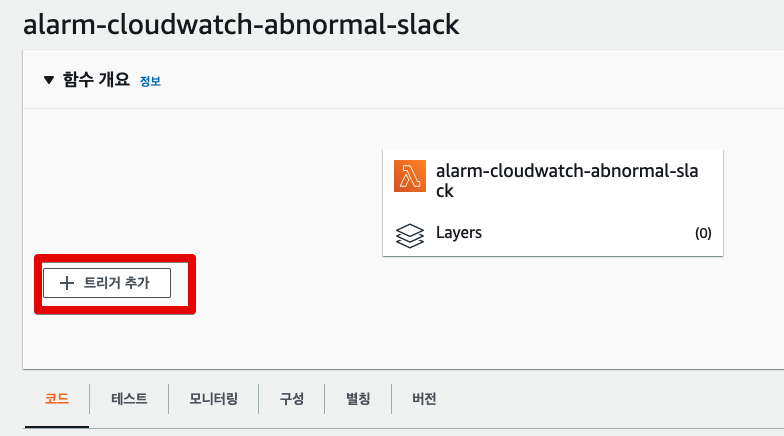
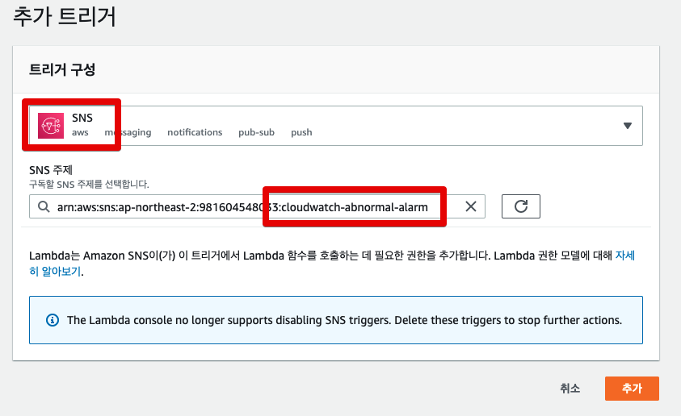
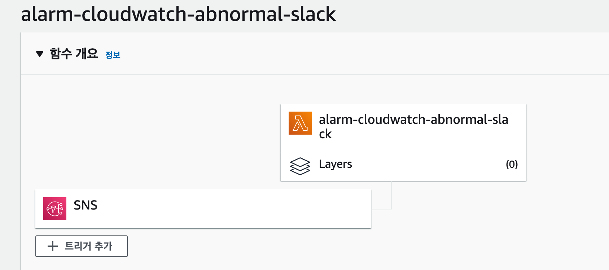
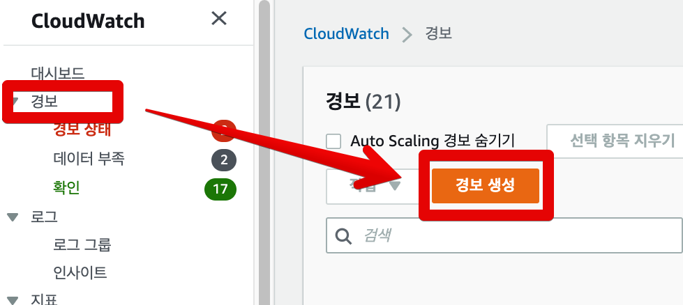
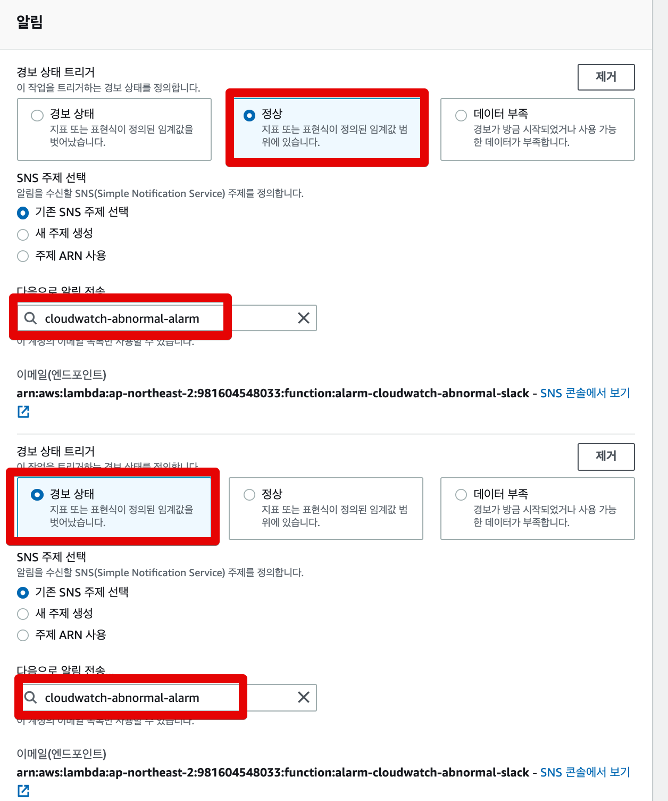
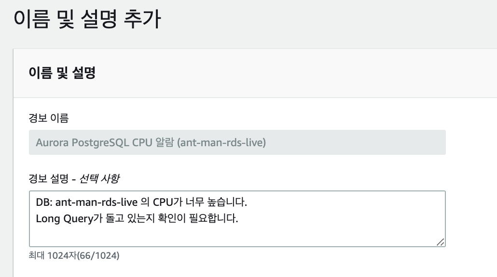

# CloudWatch 이상 지표를 슬랙 알람으로 받기 (feat. SNS, Lambda)

AWS 서비스를 이용하면 CloudWatch를 통해 서비스의 이상 지표를 손쉽게 확인할 수 있습니다.  
이를테면 다음과 같은 경우인데요.

* 평소보다 로드밸런서로 들어오는 요청양이 2배이상 높다거나
* RDS의 CPU가 60%이상이 된다거나
* RDS에 사용중인 Connection이 갑자기 줄어든다거나 

등등의 경우입니다.  
이때 별도의 알람을 붙여놓지 않는다면 **서비스가 죽고 나서야 알게 됩니다**.  
  
그래서 위와 같이 이상지표가 발생하면 즉시 Slack 등 메신저를 통해 알람을 받아야만 하는데요.  
AWS에서는 SNS와 Lambda를 통해 CloudWatch의 이상 지표를 손쉽게 알람을 받을 수 있습니다.  


이번 시간에는 CloudWatch와 SNS, Lambda를 활용해 이상 지표 알람 서비스를 만들어보겠습니다.

## 1. SNS 토픽 생성

맨 먼저 SNS 주제 (Topic)을 만듭니다.  
  
아래 그림을 따라 차례로 진행합니다.


이렇게 만들어진 SNS는 바로 Lambda와 연결됩니다.  

## 2. Lambda 함수 생성

두번째로 Lambda 를 생성해보겠습니다.  


기본적인 Lambda 설정 후, 실제 SNS 메세지를 분해해서 Slack으로 메세지를 보내는 코드를 작성해보겠습니다.

### 2-1. Lambda 함수 코드 추가

전체 코드는 다음과 같습니다.

```js
// 구성 -> 환경변수로 webhook을 받도록 합니다.
const ENV = process.env
if (!ENV.webhook) throw new Error('Missing environment variable: webhook')

const webhook = ENV.webhook;
const https = require('https')

const statusColorsAndMessage = {
    ALARM: {"color": "danger", "message":"위험"},
    INSUFFICIENT_DATA: {"color": "warning", "message":"데이터 부족"},
    OK: {"color": "good", "message":"정상"}
}

const comparisonOperator = {
    "GreaterThanOrEqualToThreshold": ">=",
    "GreaterThanThreshold": ">",
    "LowerThanOrEqualToThreshold": "<=",
    "LessThanThreshold": "<",
}

exports.handler = async (event) => {
    await exports.processEvent(event);
}

exports.processEvent = async (event) => {
    console.log('Event:', JSON.stringify(event))
    const snsMessage = event.Records[0].Sns.Message;
    console.log('SNS Message:', snsMessage);
    const postData = exports.buildSlackMessage(JSON.parse(snsMessage))
    await exports.postSlack(postData, webhook);
}

exports.buildSlackMessage = (data) => {
    const newState = statusColorsAndMessage[data.NewStateValue];
    const oldState = statusColorsAndMessage[data.OldStateValue];
    const executeTime = exports.toYyyymmddhhmmss(data.StateChangeTime);
    const description = data.AlarmDescription;
    const cause = exports.getCause(data);

    return {
        attachments: [
            {
                title: `[${data.AlarmName}]`,
                color: newState.color,
                fields: [
                    {
                        title: '언제',
                        value: executeTime
                    },
                    {
                        title: '설명',
                        value: description
                    },
                    {
                        title: '원인',
                        value: cause
                    },
                    {
                        title: '이전 상태',
                        value: oldState.message,
                        short: true
                    },
                    {
                        title: '현재 상태',
                        value: `*${newState.message}*`,
                        short: true
                    },
                    {
                        title: '바로가기',
                        value: exports.createLink(data)
                    }
                ]
            }
        ]
    }
}

// CloudWatch 알람 바로 가기 링크
exports.createLink = (data) => {
    return `https://console.aws.amazon.com/cloudwatch/home?region=${exports.exportRegionCode(data.AlarmArn)}#alarm:alarmFilter=ANY;name=${encodeURIComponent(data.AlarmName)}`;
}

exports.exportRegionCode = (arn) => {
    return  arn.replace("arn:aws:cloudwatch:", "").split(":")[0];
}

exports.getCause = (data) => {
    const trigger = data.Trigger;
    const evaluationPeriods = trigger.EvaluationPeriods;
    const minutes = Math.floor(trigger.Period / 60);

    if(data.Trigger.Metrics) {
        return exports.buildAnomalyDetectionBand(data, evaluationPeriods, minutes);
    }

    return exports.buildThresholdMessage(data, evaluationPeriods, minutes);
}

// 이상 지표 중 Band를 벗어나는 경우
exports.buildAnomalyDetectionBand = (data, evaluationPeriods, minutes) => {
    const metrics = data.Trigger.Metrics;
    const metric = metrics.find(metric => metric.Id === 'm1').MetricStat.Metric.MetricName;
    const expression = metrics.find(metric => metric.Id === 'ad1').Expression;
    const width = expression.split(',')[1].replace(')', '').trim();

    return `${evaluationPeriods * minutes} 분 동안 ${evaluationPeriods} 회 ${metric} 지표가 범위(약 ${width}배)를 벗어났습니다.`;
}

// 이상 지표 중 Threshold 벗어나는 경우 
exports.buildThresholdMessage = (data, evaluationPeriods, minutes) => {
    const trigger = data.Trigger;
    const threshold = trigger.Threshold;
    const metric = trigger.MetricName;
    const operator = comparisonOperator[trigger.ComparisonOperator];

    return `${evaluationPeriods * minutes} 분 동안 ${evaluationPeriods} 회 ${metric} ${operator} ${threshold}`;
}

// 타임존 UTC -> KST
exports.toYyyymmddhhmmss = (timeString) => {

    if(!timeString){
        return '';
    }

    const kstDate = new Date(new Date(timeString).getTime() + 32400000);

    function pad2(n) { return n < 10 ? '0' + n : n }

    return kstDate.getFullYear().toString()
        + '-'+ pad2(kstDate.getMonth() + 1)
        + '-'+ pad2(kstDate.getDate())
        + ' '+ pad2(kstDate.getHours())
        + ':'+ pad2(kstDate.getMinutes())
        + ':'+ pad2(kstDate.getSeconds());
}

exports.postSlack = async (message, slackUrl) => {
    return await request(exports.options(slackUrl), message);
}

exports.options = (slackUrl) => {
    const {host, pathname} = new URL(slackUrl);
    return {
        hostname: host,
        path: pathname,
        method: 'POST',
        headers: {
            'Content-Type': 'application/json'
        },
    };
}

function request(options, data) {

    return new Promise((resolve, reject) => {
        const req = https.request(options, (res) => {
            res.setEncoding('utf8');
            let responseBody = '';

            res.on('data', (chunk) => {
                responseBody += chunk;
            });

            res.on('end', () => {
                resolve(responseBody);
            });
        });

        req.on('error', (err) => {
            console.error(err);
            reject(err);
        });

        req.write(JSON.stringify(data));
        req.end();
    });
}
```

저 같은 경우 `exports`로 만든 function들은 `jest`로 모두 테스트코드를 작성해서 굳이 Lambda로 테스트를 안하더라도, 대부분이 기능을 빠르게 검증/수정하였습니다.  

```js
describe('index.js', () => {

    it('file load', () => {
        expect(testObject.AlarmName).toBe('RDS-CPUUtilization-high');
    });

    it('시간 변경', () => {
        const time = '2021-07-14T23:20:50.708+0000';
        const kstTime = toYyyymmddhhmmss(time);
        expect(kstTime).toBe('2021-07-15 17:20:50');
    });

    it('region code 추출', () => {
        const arn = "arn:aws:cloudwatch:ap-northeast-2:123123:alarm:Aurora PostgreSQL CPU 알람 (60%이상시)";
        const result = exportRegionCode(arn);

        expect(result).toBe('ap-northeast-2');
    });

    it('link', () => {
        const result = createLink(testObject);
        expect(result).toBe('https://console.aws.amazon.com/cloudwatch/home?region=ap-northeast-2#alarm:alarmFilter=ANY;name=Aurora%20PostgreSQL%20CPU%20%EC%95%8C%EB%9E%8C%20(60%25%EC%9D%B4%EC%83%81%EC%8B%9C)');
    });

    ...
});
```

> 모든 코드는 [Github](https://github.com/jojoldu/blog-code/tree/master/aws/cloudwatch-alarm)에 있습니다.

작성된 Lambda를 실행하기 위해서는 Lambda 환경 변수에 `webhook` 값을 등록해야합니다.  
(`const webhook = ENV.webhook;` 에서 사용되는 값입니다.)    
  
환경 변수는 아래와 같이 구성 -> 환경변수로 차례로 등록합니다.




> Slack 웹훅 API를 아직 안만드셨다면, [이전에 작성된 글](https://jojoldu.tistory.com/552)을 참고해주세요.

### 2-2. Lambda 테스트

작성된 Lambda 테스트를 하기 위해서 **SNS 메세지를 임의로** 만들어보겠습니다.

```json
{
  "Records": [
    {
      "EventSource": "aws:sns",
      "EventVersion": "1.0",
      "EventSubscriptionArn": "arn:aws:sns:ap-northeast-2:981604548033:alarm-topic:test",
      "Sns": {
        "Type": "Notification",
        "MessageId": "test",
        "TopicArn": "arn:aws:sns:ap-northeast-2:123123:test-alarm-topic",
        "Subject": "ALARM: \"RDS-CPUUtilization-high\" in Asia Pacific (Seoul)",
        "Message": "{\"AlarmName\":\"Aurora PostgreSQL CPU 알람 (60%이상시)\",\"AlarmDescription\":\"Aurora PostgreSQL CPU 알람 (60%이상시)\",\"AWSAccountId\":\"981604548033\",\"NewStateValue\":\"ALARM\",\"NewStateReason\":\"Threshold Crossed: 3 out of the last 3 datapoints [8.891518474692088 (14/07/21 23:18:00), 9.72 (14/07/21 23:17:00), 9.18241509182415 (14/07/21 23:16:00)] were greater than or equal to the threshold (7.0) (minimum 3 datapoints for OK -> ALARM transition).\",\"StateChangeTime\":\"2021-07-14T23:20:50.708+0000\",\"Region\":\"Asia Pacific (Seoul)\",\"AlarmArn\":\"arn:aws:cloudwatch:ap-northeast-2:981604548033:alarm:Aurora PostgreSQL CPU 알람 (60%이상시)\",\"OldStateValue\":\"OK\",\"Trigger\":{\"MetricName\":\"CPUUtilization\",\"Namespace\":\"AWS/RDS\",\"StatisticType\":\"Statistic\",\"Statistic\":\"MAXIMUM\",\"Unit\":null,\"Dimensions\":[{\"value\":\"aurora-postgresql\",\"name\":\"EngineName\"}],\"Period\":60,\"EvaluationPeriods\":3,\"ComparisonOperator\":\"GreaterThanOrEqualToThreshold\",\"Threshold\":7,\"TreatMissingData\":\"- TreatMissingData:                    ignore\",\"EvaluateLowSampleCountPercentile\":\"\"}}",
        "Timestamp": "2021-06-07T11:31:17.380Z",
        "SignatureVersion": "1",
        "MessageAttributes": {}
      }
    }
  ]
}
```

> 이 외에 다양한 형태의 SNS 메세지는 [Github](https://github.com/jojoldu/blog-code/tree/master/aws/cloudwatch-alarm/test)에 `test.json`과 `testRequestHigh.json` 으로 확인할 수 있습니다.

위 테스트 메세지를 Lambda 테스트에 넣어보고 테스트해봅니다.



테스트 수행후, 정상적으로 Slack 알람을 받으셨다면 바로 SNS와 Lambda를 연동해보겠습니다.

### 2-3. SNS와 Lambda 연동

SNS와 Lambda는 Lambda 화면에서 트리거로 바로 추가하면 됩니다.



1에서 만들어둔 SNS를 선택해 추가합니다.





여기까지 SNS와 Lambda까지 연동이 되었다면 이제 CloudWatch 경보를 SNS와 연동만 하면 됩니다.

## 3. CloudWatch 경보와 SNS 연동

CloudWatch 경보 페이지로 가서 경보를 생성합니다.



본인이 원하는 여러 지표들 중 이번 알람으로 보고 싶은 지표를 선택합니다.  

* 여기서는 DB의 CPU 지표를 대상으로 삼았습니다.


선택한 지표가 **어느 조건일때 경보를 발생**시킬지 선택합니다.

* 여기서는 CPU 지표가 60%이상일 경우 경보 발생 조건으로 삼았습니다.
 


알람 트리거를 등록하고, 발생시 SNS에 위에서 만든 SNS를 등록합니다.  



알람 트리거는 총 2개를 생성합니다.

* 정상 => 경보
* 경보/데이터부족 => 정상

둘다 넣어야, **비정상 상태에서 정상으로 돌아왔음**을 알람으로 인지할 수 있기 때문입니다.  
정상 알람을 걸어두지않으면, **아직까지 장애인지 / 장애가 해소된건지**알수가 없기 때문에 무조건 노트북을 열어 확인할 수 밖에 없습니다.  
본인의 정신건강을 위해서라도 정상 알람까지 꼭 추가하기를 추천드립니다.  
  
마지막으로 경보 이름과 설명을 추가합니다.



경보 설명은 최대한 상세하게 작성하는걸 추천드립니다.  
이 알람을 확인한 분들이 서비스/AWS 리소스을 잘 모르더라도 **이 알람이 어떤 알람인지 쉽게 이해할 수 있습니다**.  
  
여기까지 하셨다면 모든 설정은 끝났습니다.  
  
## 4. 실제 알람 발생

첫 연동 이후에 데이터부족 -> 정상으로 상태가 전환되면서 자동으로 아래와 같이 알람들이 오게 됩니다.


한번 구축된 SNS & Lambda를 통해서 이후에는 CloudWatch 경보만 계속 추가하면서 알람을 등록하면 됩니다.

