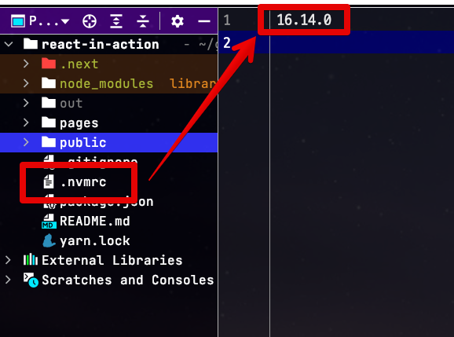

# CloudFlare Pages로 Next.js 서비스 배포하기


* [https://pages.cloudflare.com/](https://pages.cloudflare.com/)

## 1. Next.js App 생성

```bash
npx create-next-app react-in-action --use-npm --example "https://github.com/vercel/next-learn/tree/master/basics/learn-starter"
```

* react-in-action 으로 프로젝트를 생성한다.


```json
{
  "private": true,
  "scripts": {
    "dev": "next dev",
    "build": "next build && next export",
    "start": "next start"
  },
  "dependencies": {
    "next": "latest",
    "react": "17.0.2",
    "react-dom": "17.0.2"
  }
}
```

```bash
yarn build
```

* `npm`을 쓴다면 `npm run build`

```bash
yarn run v1.22.10
$ next build && next export
...
info  - Copying "static build" directory
info  - No "exportPathMap" found in "undefined". Generating map from "./pages"
info  - Launching 11 workers
info  - Copying "public" directory
info  - Exporting (2/2)
Export successful. Files written to /Users/jojoldu/git/react-in-action/out
✨  Done in 4.31s.
```

성공적으로 `build` 와 `export`가 되었다면 아래와 같이 `out` 디렉토리가 생성되야만 한다.


만약 Node 버전을 12.x 이상 사용해야 한다면 `.nvmrc` 를 통해 Cloudflare Node 버전을 정할 수 있다.  
여기서는 `16.4.0` 버전을 사용한다.



## 2. Cloudflare Pages 설정

