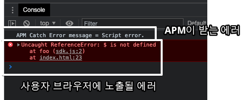

# 프론트엔드 모니터링에서 Script error. 만 나올때

프론트엔드 모니터링을 보다보면 다음과 같이 `Script error.` 만 나올때가 있습니다.


나머지 에러들은 정확하게 에러가 노출되지만, 특정 케이스에 한해서 `Script error.` 만 나오게 되는 것인데요.  
  
왜 모니터링에서는 `Script error.` 만 나오며, 이를 해결하기 위해선 어떻게 해야하는지 알아보겠습니다.

## 1. 배경 소개

예를 들어 다음과 같은 `sdk.js` 파일을 사용하는 웹 페이지가 있다고 가정해봅니다.

**sdk.js**

```javascript
function foo() {
    console.log($('#a').text());
}
```

**index.html**

```html
<body>
<script src="https://code.jquery.com/jquery-1.12.4.min.js"></script>
<script src="https://junior-recruit-scheduler.s3.ap-northeast-2.amazonaws.com/sdk.js"></script>

<p id="a"> test </p>
<script>
    /**
     * 비지니스 로직
     */
    foo();

</script>
</body>
```

코드는 간단합니다.

* `sdk.js` 와 `jquery`를 호출하고, 이를 `index.html`이 `sdk.js`의 `foo` funciton을 호출
    * `sdk.js`는 `jquery`를 의존

현 코드상에는 큰 문제가 없습니다.  
자 그리고 이제 **프론트 모니터링 코드**를 간략하게 만들어볼텐데요.  

```html
<body>
<script src="https://code.jquery.com/jquery-1.12.4.min.js"></script>
<script src="https://junior-recruit-scheduler.s3.ap-northeast-2.amazonaws.com/sdk.js"></script>

<p id="a"> test </p>
<script>
    /**
     * APM 내부 구현
     */
    window.onerror = function (message) {
        // 원래는 ajax로 에러 내용을 전달해야하지만, 여기서는 간단하게 console로 출력
        console.log(`APM Catch Error message = ${message}`);
    }

    /**
     * 비지니스 로직
     */
    foo();

</script>
</body>
```

> 실제 모니터링의 코드는 위 보다 훨씬 고도화 되었지만, 저희가 사용중인 프론트 모니터링의 코드는 [글로벌 에러 핸들링](https://developer.mozilla.org/en-US/docs/Web/API/GlobalEventHandlers/onerror) 하는 관점에서는 비슷한 컨셉으로 보면 될 것 같습니다. 

이렇게 구성할 경우 HTML 페이지 어디에서 발생하는 에러라도 `window.onerror`를 통해 내용을 수신 받을 수 있는데요.  


모니터링에 대한 로그와 실제 콘솔에 출력되는 로그가 동일하게 출력되는 것을 볼 수 있습니다.  
  
## 2. 문제 상황

자 그럼 강제로 문제 상황을 만들어볼텐데요.  
기존 `sdk.js`는 코드 변경이 없는데, **의존하고 있는 jquery를 못불러오는** 상황을 만들어보겠습니다.

* jquery는 `code.jquery.com` 를 통해서 가져오기 때문에 해당 CDN에 문제가 있어서 가져오지 못한 경우라고 보시면 됩니다.

> 꼭 의존하는 JS를 못불러오는 것 외에도 `sdk.js`가 에러가 발생하는 상황이면 언제든 재현됩니다.  
> 여기서는 **sdk.js는 정상작동함에도 sdk.js가 의존하는 다른 JS로 인해** 문제가 발생할 경우를 재현했습니다.

```html
<body>
<!-- jquery 호출을 주석처리해 sdk.js가 문제 발생 -->
<!-- <script src="https://code.jquery.com/jquery-1.12.4.min.js"></script> -->
<script src="https://junior-recruit-scheduler.s3.ap-northeast-2.amazonaws.com/sdk.js"></script>

<p id="a"> test </p>
<script>
    /**
     * APM 내부 구현
     */
    window.onerror = function (message) {
        // 원래는 ajax로 에러 내용을 전달해야하지만, 여기서는 간단하게 console로 출력
        console.log(`APM Catch Error message = ${message}`);
    }

    /**
     * 비지니스 로직
     */
    foo();

</script>
</body>
```

이렇게 할 경우 콘솔 로그와 모니터링 로그는 어떻게 될까요?



보시는 것처럼 **Script error**만 노출되고, 원래 발생했었어야할 `$ is not defined` 는 사용자의 콘솔에서만 볼 수 있게 됩니다.  
  
자 왜 이렇게 콘솔에 출력되는 것과 `onerror`로 잡은 로그는 다른 메세지가 나올까요?

## 3. 원인 분석

아마 여기까지 보신 분들은 납득이 잘 안되실텐데요.

* 그간 외부 SDK 오류가 발생해도 모니터링에는 잘 나왔는데??

이건 2가지 경우가 있습니다.

* 외부 SDK가 CORS를 오픈해서 허용할 경우
* 외부 SDK를 내부 CDN으로 돌리고, 서브 도메인에 대해서만 CORS를 허용한 경우

결국은 **CORS가 열려있지 않은 외부 JS에서 발생한 에러**는 모니터링에서 `Script error`가 발생하는 것인데요.


[참고-What the heck is "Script error"](https://blog.sentry.io/2016/05/17/what-is-script-error)

그래서 프론트 모니터링에서는 CORS가 열려있지 않은 SDK의 오류는 정확히 추적이 불가능합니다.  
  
그리고 위에서 사용한 `sdk.js`는 CORS가 열려있지 않습니다.


자 그럼 이 문제를 해결하려면 어떻게 해야할까요?

## 4. 해결책

일단 이 `Script error` 문제가 아니더라도 **외부 SDK는 웬만해선 내부 CDN으로 이관**하는 것을 추천합니다.

* **외부 CDN이 장애나면 우리서비스까지 영향이 가는것을 막기 위해**
    * 이번 같이 `sdk.js`가 의존하는 jQuery가 해당 CDN의 이슈로 못불러오면 에러가 발생하기 때문입니다.  

자 그럼 내부 CDN을 쓴다고 가정하고, 다음과 같이 작업을 진행하면 됩니다.  
  
호출하는 우리쪽 코드는 `crossorigin="anonymous"` 을 넣고,


SDK 측에서는 **CORS를 글로벌 OPEN (*)** 하거나 **서브 도메인만 허용하던가** 둘 중 하나는 적용 되어 CORS 문제가 발생하지 않도록 합니다.


이렇게 할 경우 다음과 같이 모니터링에도 정상적으로 에러를 추적할 수 있게 됩니다.


