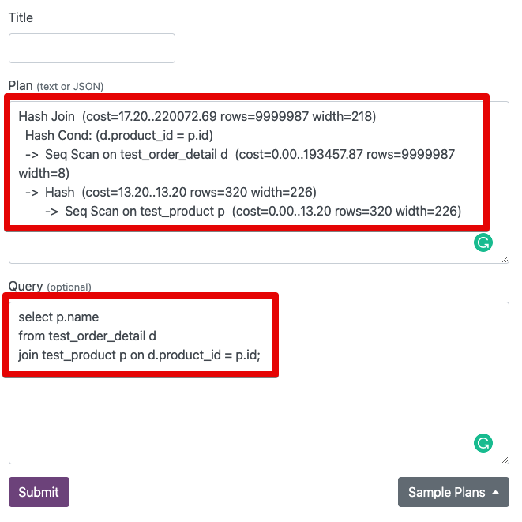
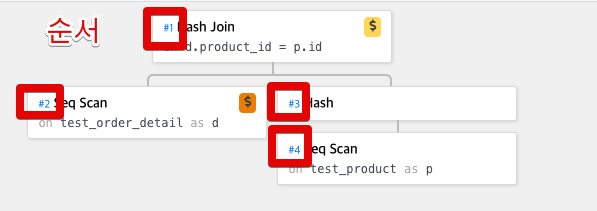

# (기본적인) PostgreSQL 실행 계획 보는 법

* AWS RDS PostgreSQL 10.15
* r5.2xlarge

## 실행계획 사용법

```sql
EXPLAIN [ ( option [, ...] ) ] statement
EXPLAIN [ ANALYZE ] [ VERBOSE ] statement
```

이 명령 은 제공된 문에 대해 PostgreSQL 플래너가 생성 하는 실행 계획을 표시합니다 . 실행 계획은 명령문에서 참조하는 테이블이 일반 순차 스캔, 인덱스 스캔 등을 통해 스캔되는 방법을 보여줍니다. 여러 테이블이 참조되는 경우 각 테이블에서 필요한 행을 모으기 위해 어떤 조인 알고리즘이 사용됩니다. 입력 테이블.

디스플레이에서 가장 중요한 부분은 예상 된 명령문 실행 비용으로, 이는 명령문을 실행하는 데 걸리는 시간 (임의적이지만 일반적으로 디스크 페이지 가져 오기를 의미하는 비용 단위로 측정 됨)에 대한 플래너의 추측입니다. 실제로 두 개의 숫자가 표시됩니다. 첫 번째 행이 반환되기 전의 시작 비용과 모든 행을 반환하는 데 필요한 총 비용입니다. 대부분의 쿼리에서 총 비용이 중요하지만의 하위 쿼리와 같은 컨텍스트 EXISTS에서 플래너는 가장 작은 총 비용 대신 가장 작은 시작 비용을 선택합니다 (어쨌든 실행 프로그램이 한 행을 얻은 후 중지되기 때문입니다). 또한 LIMIT절로 반환 할 행 수를 제한하면 플래너는 엔드 포인트 비용간에 적절한 보간을 수행하여 어떤 계획이 실제로 가장 저렴한 지 추정합니다.

이 ANALYZE옵션은 명령문이 계획된 것이 아니라 실제로 실행되도록합니다. 그런 다음 각 계획 노드 내에서 소요 된 총 경과 시간 (밀리 초) 및 실제로 리턴 된 총 행 수를 포함하여 실제 런타임 통계가 디스플레이에 추가됩니다. 이는 플래너의 추정치가 현실에 가까운 지 확인하는 데 유용합니다.

ANALYZE옵션이 사용될 때 명령문이 실제로 실행된다는 점에 유의하십시오 . 

> 각 옵션에 대한 좀 더 자세한 설명은 [공식문서](https://www.postgresql.org/docs/10/sql-explain.html) 을 참고하시면 됩니다.
 
## 1. 실행 순서

* 동일한 위치에선 **위에서 아래**로 실행되며 
* **그룹내 계층구조**에선 **가장 아래부터 시작**합니다.

**ex 1)**

```bash
1 ======  
2 ======  
3 ======  
```
실행순서 : 1 -> 2 -> 3

* 동일한 위치로 1,2,3이 있으므로 위에서 아래로 실행됩니다.

**ex 2)**

```bash
1 ======  
2  =====  
3   ====
```  
실행순서 : 3 -> 2 -> 1

* 1,2,3이 한그룹의 계층구조로 되어 있으므로 가장 아래부터 실행됩니다.

**ex 3)**

```bash
1 ======  
2  =====  
3  =====
```

실행순서 : 2 -> 3 -> 1

* 1 은 2, 3을 갖고 있으니 순서상 둘 보다 뒤로 밀리며 2,3은 동등한 위치이므로 둘 중 위에 선언된 2가 실행된 뒤 3이 실행되고 마지막으로 1이 실행됩니다.

**ex 4)**

```bash
1 ======  
2  =====  
3  =====  
4   ====  
5    ===
```

실행순서 : 2 -> 5 -> 4 -> 3 -> 1

* 1 아래에 2 3이 동등한 위치에 있으므로 2가 먼저 실행되고 
* 3은 같은 그룹으로 4,5 가 있어서 5 -> 4 -> 3 이 되고
* 마지막으로 1이 실행됩니다.

### Visual Explain

위 순서를 기억하기 어렵다면, 실행 계획 Visual 도구를 이용하면 좋습니다.  
  
아래 사이트로 접속 하신 뒤,

* [explain.dalibo](https://explain.dalibo.com/)

실행계획을 넣으시면



아래와 같이 실행 계획의 각 라인이 몇번째 순서인지 알 수 있습니다.



만약 `explain analyze` 를 이용한 쿼리 플랜 결과를 사용한다면 실제 수행시간도 표기 되기 때문에 이 중 가장 오래 걸린 작업부터 먼저 최적화 대상으로 삼으시면 됩니다.


> ANALYZE 는 실제 쿼리를 실행하기 때문에 혹시나 오랜 시간 수행되는 쿼리의 플랜을 확인할때는 서비스에 영향이 없게 주의해서 수행해야합니다.

## 실습 환경

### 테스트 스키마

```sql
create table test_order(
    id          bigserial not null constraint test_order_pk primary key,
    customer_id varchar(20),
    comment     varchar(100),
    order_date  timestamp with time zone
);

CREATE TABLE test_order_detail(
    id         bigserial not null constraint test_order_detail_pk primary key,
    order_id   BIGINT    NOT NULL,
    product_id BIGINT    NOT NULL,
    comment    varchar(100),
    amount     BIGINT
);

CREATE INDEX idx_test_order_detail_01 ON test_order_detail (order_id);
CREATE INDEX idx_test_order_detail_02 ON test_order_detail (product_id);

CREATE TABLE test_product(
    id   bigserial    not null constraint test_product_pk primary key,
    name VARCHAR(100) NOT NULL
);
```

### 테스트 데이터 만들기

```sql
insert into test_order (customer_id, comment, order_date)
select 'C' || mod(i, 10) as customer_id, 
       lpad('X', 10, 'Y') as comment, 
       timestamp '1970-01-01 00:00:01' + random() * (timestamp '1970-01-01 00:00:01' - timestamp '2021-05-23 23:59:59') as order_date
from generate_series(1, 1000000) a(i);

INSERT INTO test_order_detail (order_id, product_id, comment, amount)
SELECT mod(i, 1000000) as order_id, 
       MOD(i, 5) as product_id, 
       lpad('X', 10, 'Y') as comment, 
       case when i < 1000 then i * 100 else i end as amount
FROM generate_series(1, 10000000) a(i);

INSERT INTO test_product (id, name)
SELECT product_id, MAX(order_id) || 'TEST_NAME'
FROM test_order_detail
GROUP BY product_id;
```

## 상황별 실행 계획

### 기본적인 실행계획 보는법 (feat. 테이블 풀 스캔)

**실행쿼리**

```sql
select * from test_order;
```

**실행계획**

```sql
Seq Scan on test_order  (cost=0.00..17353.00 rows=1000000 width=30)
```

* `Seq Scan`
  * 객체(Table or View 등)에 **어떤 방식으로 실행**하는지를 나타냄
  * `Seq Scan` 은 **파일을 순차적으로 접근**해서 해당 테이블의 전체 데이터를 읽음을 의미 (즉, 테이블 풀 스캔)
  * 인덱스가 있음에도 Seq Scan이 나온다면, 옵타마이저 판단하기에 인덱스를 탐색하고 다시 테이블을 탐색하는 것 보다는 (이를테면 범위검색인데 전체 데이터의 70%, 80%가 대상인 경우 등) 테이블 전체를 조회하는게 낫다고 판단하는 경우도 있다.
* `on test_order`
  * 조작 대상 객체
    * 테이블, View 등
  * 여기서는 `test_order` 테이블을 대상으로 한다는 것을 의미
* `cost=0.00..17353.00`
  * `0.00`: 시작비용
    * 출력 단계가 시작되기 전에 소비되는 시간 (예 : 정렬 노드에서 정렬을 수행하는 시간)
  * `17353.00`: 최종비용
    * 해당 노드가 완료 될 때까지 실행되었을때를 가정한 최종 완료 시간
* `rows=1000000`
  * 조작 대상 row 수
  * 즉, 현 조건에 해당하는 `test_order` 에서 조회될 예상 건수를 의미

### 인덱스 스캔

**실행쿼리**

```sql
select * from test_order where id between 1 and 10000;
```

**실행계획**

```sql
Index Scan using test_order_pk on test_order  (cost=0.42..422.13 rows=10885 width=30)
  Index Cond: ((id >= 1) AND (id <= 10000))
```

* `Index Scan using test_order_pk on test_order`
  * 인덱스를 이용해 Scan을 했음을 의미
  * 사용한 인덱스는 `test_order_pk` 이며, 대상 객체는 `test_order` 가 되었음을 알 수 있음 
* `Index Cond`
  * 인덱스 스캔에 사용된 조회 조건

만약 여러 조회조건이 섞여 있고, 이 중 인덱스를 사용하는 조건과 그렇지 않은 조건이 같이 있다면 다음과 같이 결과가 나온다.

**실행쿼리**

```sql
select *
from test_order
where id between 1 and 10000
  and order_date > '2020-01-01 00:00:00';
```

**실행계획**

```sql
Index Scan using test_order_pk on test_order  (cost=0.42..449.34 rows=1 width=30)
  Index Cond: ((id >= 1) AND (id <= 10000))
  Filter: (order_date > '2020-01-01 00:00:00+09'::timestamp with time zone)
```

* `Filter`
  * 인덱스가 아닌 일반적인 조건을 통해 데이터를 걸렀음을 의미
* 실행 순서

### Table Join

* Nested Loop
* Sort Merge
* Hash

```sql
select p.name
from test_order_detail d
join test_product p on d.product_id = p.id;
```

```sql
Hash Join  (cost=17.20..220072.69 rows=9999987 width=218) (1)
  Hash Cond: (d.product_id = p.id)
  ->  Seq Scan on test_order_detail d  (cost=0.00..193457.87 rows=9999987 width=8) (2)
  ->  Hash  (cost=13.20..13.20 rows=320 width=226) (3)
        ->  Seq Scan on test_product p  (cost=0.00..13.20 rows=320 width=226) (4)
```

실행 순서

(2) `Seq Scan on test_order_detail d`
(4) `Seq Scan on test_product p`
(3) `Hash  (cost=13.20..13.20 rows=320 width=226)`
(1) `Hash Join  (cost=17.20..220072.69 rows=9999987 width=218)`

* 결합 (`HashJoin`) 전에 테이블 접근이 먼저 수행