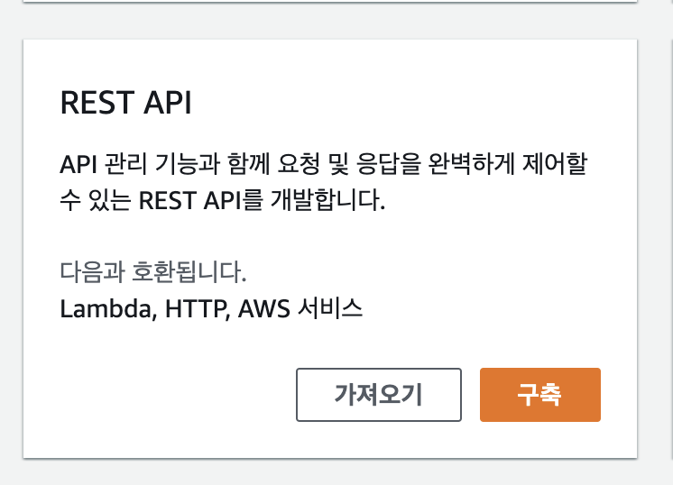
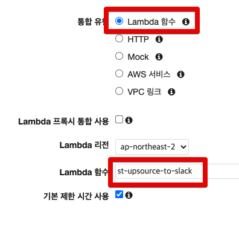
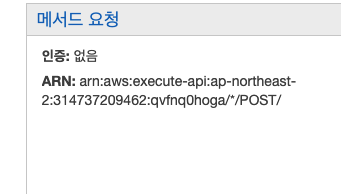
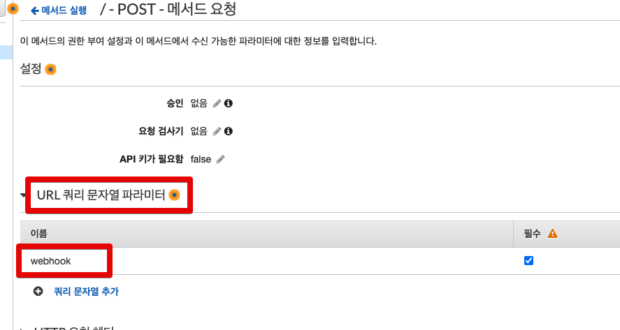
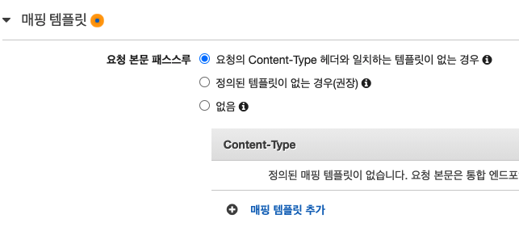
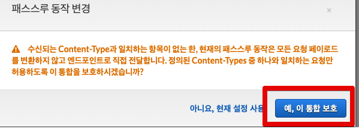
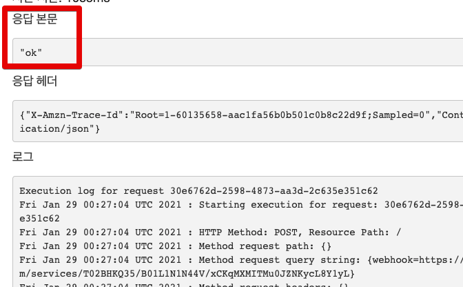
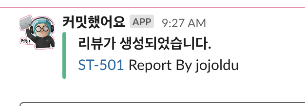

# Slack webhook 으로 Upsource 코드 리뷰 알람 받기

현재 Upsource는 Slack과의 통합 (Integration)을 지원하지 않습니다.  

[Integration with slack is not working via webhook](https://youtrack.jetbrains.com/issue/UP-10213)  
  
그래서 어쩔 수 없이 Slack의 웹훅을 통해 직접 연동을 구현해야하는데요.  
  
여기서 문제는, **Upsource는 웹훅 URL 호출만** 지원합니다.  
즉, Upsource의 메세지를 파싱해서 Slack 웹훅 포맷에 맞게 JSON을 만들어 보내는 등의 **로직이 있는 형태를 사용할 수가 없습니다**.  
  
그래서 Upsource -> Slack 사이에서 Upsource의 알람을 받아 파싱해서 Slack 웹훅을 호출해주는 중간 애플리케이션이 필수가 됩니다.  
  
단순히 코드리뷰 알람을 위해 별도의 서버를 구축하기는 아까우니, AWS API Gateway와 AWS Lambda를 이용해서 중간 애플리케이션을 구축해보겠습니다.  
  
그래서 전체 구조는 다음과 같이 됩니다.

**Slack Webhook 생성은 필수**입니다.  
  
아직 생성안하셨다면 미리 생성하고 시작하시면 됩니다.

> Slack Webhook 생성하기는 [기존 포스팅](https://jojoldu.tistory.com/552)을 참고해주세요.

## Upsource Webhook

API

```bash
http://본인들 Upsoure 도메인/~api_doc/index.html#webhooks
```

```bash
POST /my-webhook HTTP/1.1
Host: example.com
Content-Type: application/json; charset=UTF-8
Content-Length: XXX
Connection: close
User-Agent: Jakarta Commons-HttpClient/3.1
X-Request-Id: c8a5b163-508f-42b5-939a-e11b02caf72e

{
    "majorVersion": 3,
    "minorVersion": 0,
    "projectId": "demo-project",
    "dataType": "NewRevisionEventBean",
    "data": {
        "revisionId": "c1f4de8e6c5aca9b5615fa6656e1f26e4f26d0d0",
        "branches": [
        "master"
        ],
        "author": "John Doe <john.doe@mycompany.com>",
        "message": "#DSH-325 extract directives describes to top level\n",
        "date": 1454432013000
    }
}
```

```bash
http://본인들 Upsoure 도메인/~api_doc/integration/index.html
```


```bash
{
    "majorVersion": 3,
    "minorVersion": 0,
    "projectId": "settler",
    "dataType": "ReviewCreatedFeedEventBean",
    "data": {
        "revisionId": "c1f4de8e6c5aca9b5615fa6656e1f26e4f26d0d0",
        "branches": [
            "master"
        ],
        "base": {
            "reviewId": "ST-501",
            "actor": {
                "userName": "jojoldu"
            },
            "feedEventId": "created"
        },
        "author": "jojoldu <jojoldu@gmail.com>",
        "date": 1454432013000
    }
}
```

## AWS

### Lambda

> 전체 코드는 [Github](https://github.com/jojoldu/blog-code/tree/master/upsource-to-slack)에 있으니 참고하시면 됩니다.
 
**app.js**

```js
const https = require('https');
const UPSOURCE_HOST = 'http://upsource.test.com'; // 본인 Upsource 주소

exports.handler = async (event) => {
    console.log('event: '+JSON.stringify(event));

    const webhook = event.params.querystring.webhook;
    const message = exports.message(event.body, UPSOURCE_HOST);

    return await exports.postSlack(message, webhook);
};

exports.postSlack = async (message, slackUrl) => {
    return await request(exports.options(slackUrl), message);
}

exports.options = (slackUrl) => {
    const {host, pathname} = new URL(slackUrl);
    return {
        hostname: host,
        path: pathname,
        method: 'POST',
        headers: {
            'Content-Type': 'application/json'
        },
    };
}

exports.message = (eventBody, upsourceHost) => {
    const reviewId = eventBody.data.base.reviewId;
    const title = exports.convert(eventBody.dataType);
    const user = eventBody.data.base.actor.userName;
    const projectId = eventBody.projectId;

    return {
        attachments: [
            {
                color: '#2eb886',
                title: `${title}`,
                fields: [
                    {
                        value: `<${upsourceHost}/${projectId}/review/${reviewId}|${reviewId}> Report By ${user}`,
                        short: false
                    }
                ]
            }
        ]
    };
}

exports.convert = (dataType) => {
    if(dataType === 'ReviewCreatedFeedEventBean') {
        return '리뷰가 생성되었습니다.';
    } else if (dataType === 'RevisionAddedToReviewFeedEventBean') {
        return '리뷰에 새 코드가 반영되었습니다.';
    } else {
        return '리뷰에 변경 사항이 있습니다.';
    }
}

function request(options, data) {
    return new Promise((resolve, reject) => {
        const req = https.request(options, (res) => {
            res.setEncoding('utf8');
            let responseBody = '';

            res.on('data', (chunk) => {
                responseBody += chunk;
            });

            res.on('end', () => {
                resolve(responseBody);
            });
        });

        req.on('error', (err) => {
            console.error(err);
            reject(err);
        });

        req.write(JSON.stringify(data));
        req.end();
    });
}
```

저 코드를 그대로 복사하셔도 되는데, 혹시나 작업 중간중간 function의 단위 테스트가 필요하시면 아래를 참고해보셔도 좋습니다.

> 테스트 도구로 Jest를 사용했습니다.
  
**app.test.js**

```js
const app = require('./app');

test('request용 options 생성', () => {
    const {hostname, path, method} = app.options('https://hooks.slack.com/services/test1/test2/test3');

    expect(hostname).toBe('hooks.slack.com');
    expect(path).toBe('/services/test1/test2/test3');
    expect(method).toBe('POST');
});

describe('dataType에 맞게 메세지가 발행된다', () => {
    test('ReviewCreatedFeedEventBean 이면 리뷰 생성이다.', () => {
        const result = app.convert('ReviewCreatedFeedEventBean');

        expect(result).toBe('리뷰가 생성되었습니다.');
    });

    test('RevisionAddedToReviewFeedEventBean 이면 리뷰에 신규 코드 반영이다.', () => {
        const result = app.convert('RevisionAddedToReviewFeedEventBean');

        expect(result).toBe('리뷰에 새 코드가 반영되었습니다.');
    });

    test('나머지는 모두 리뷰내용 변경이다.', () => {
        const result = app.convert('ReviewCreatedFeedEventBean');

        expect(result).toBe('리뷰가 생성되었습니다.');
    });
});

test('request용 message 생성', () => {
    const projectId = "settler";
    const reviewId = "ST-501";
    const user = "jojoldu";
    const mockEvent =  {
        "body": {
            "projectId": projectId,
            "dataType": "ReviewCreatedFeedEventBean",
            "data": {
                "base": {
                    "reviewId": reviewId,
                    "actor": {
                        "userName": user
                    }
                }
            }
        }
    };

    const upsourceHost = 'http://upsource.test.com';
    const {attachments} = app.message(mockEvent.body, upsourceHost);

    expect(attachments.length).toBe(1);
    expect(attachments[0].title).toBe('리뷰가 생성되었습니다.');
    expect(attachments[0].fields[0].value).toBe(`<${upsourceHost}/${projectId}/review/${reviewId}|${reviewId}> Report By ${user}`);
});
```

만약 실제 슬랙 발송을 테스트해보고 싶다면 아래 파일을 테스트코드로 생성해서 실행해보시면 됩니다.

> 물론 이 파일은 실제 URL을 사용하니 ```.gitignore``` **로 Github 대상에서 제외**하셔야만 합니다.
 
**app.real.test.js**

```js
const app = require('./app');

test('slack 테스트', () => {
    const mockEvent =  {
        "body": {
            "majorVersion": 3,
            "minorVersion": 0,
            "projectId": "settler",
            "dataType": "ReviewCreatedFeedEventBean",
            "data": {
                "revisionId": "c1f4de8e6c5aca9b5615fa6656e1f26e4f26d0d0",
                "branches": [
                    "master"
                ],
                "base": {
                    "reviewId": "ST-501",
                    "actor": {
                        "userName": "jojoldu"
                    },
                    "feedEventId": "created"
                },
                "author": "jojoldu <jojoldu@gmail.com>",
                "date": 1454432013000
            }
        },
        "params": {
            "path": {},
            "querystring": {
                "webhook": "실제 웹훅 주소를 써주세요!!!" // 여기에 실제 웹훅 주소를 써주세요!!
            },
            "header": {}
        }
    };

    app.handler(mockEvent);
});
```

#### Lambda 테스트

### API Gateway


















```js
#set($allParams = $input.params())
{
"body" : $input.json('$'),
"params" : {
#foreach($type in $allParams.keySet())
    #set($params = $allParams.get($type))
"$type" : {
    #foreach($paramName in $params.keySet())
    "$paramName" : "$util.escapeJavaScript($params.get($paramName))"
        #if($foreach.hasNext),#end
    #end
}
    #if($foreach.hasNext),#end
#end
}

}
```

#### API Gateway 테스트






```bash
webhook=https://hooks.slack.com/services/......
```

```js
{
    "majorVersion": 3,
    "minorVersion": 0,
    "projectId": "settler",
    "dataType": "ReviewCreatedFeedEventBean",
    "data": {
      "revisionId": "c1f4de8e6c5aca9b5615fa6656e1f26e4f26d0d0",
      "branches": [
        "master"
      ],
      "base": {
        "reviewId": "ST-501",
        "actor": {
          "userName": "jojoldu"
        },
        "feedEventId": "created"
      },
      "author": "John Doe <john.doe@mycompany.com>",
      "message": "#DSH-325 extract directives describes to top level\n",
      "date": 1454432013000
    }
}
```

#### API Gateway 배포

## Upsource & API Gateway


