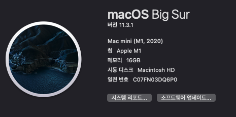
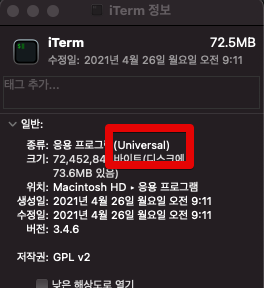
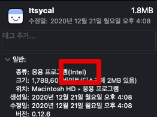
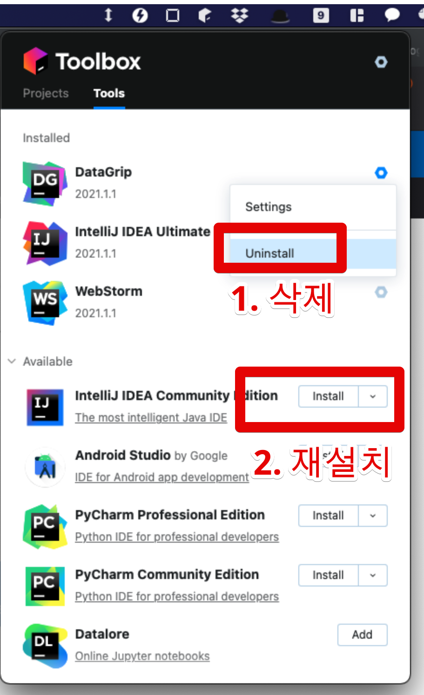
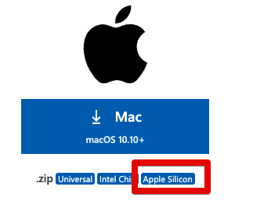
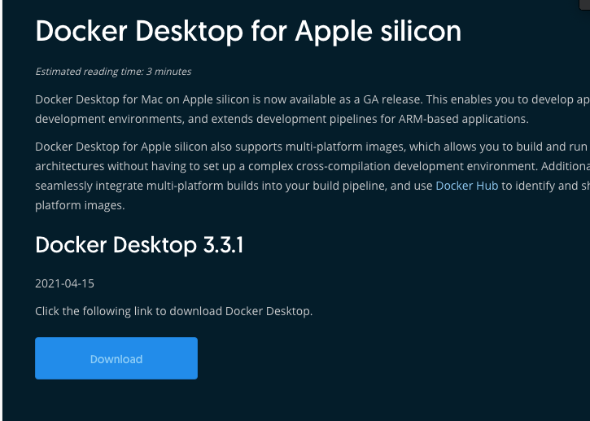
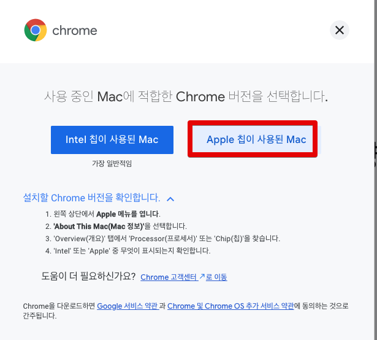

# M1 맥북 개발 환경 세팅

애플의 M1 맥북이 나오면서 많은 개발자분들이 굉장한 성능 차이를 체감하게 되시는데요.  
저 역시도 최근에 맥미니를 구매해서 사용중인데, 비슷한 가격대의 맥북 프로에 비해서 훨씬 더 쾌적하게 개발을 하고 있습니다.  



다만 기존 맥북의 설치앱들을 그대로 마이그레이션 하다보니 **Intel 버전의 앱들도 그대로 설치**되어 M1 성능을 체감못하는 경우도 있습니다.  
그래서 M1에 맞게 기존 앱들을 교체가 필요합니다.   
이번 시간에는 M1 을 위한 개발환경 설정을 진행해보겠습니다.

> 저같은 경우 **회사 업무에서는 Intel 맥북** (2019 맥북 프로) 를 사용하지만, 집에서는 M1 맥미니를 사용중입니다.  
> 아직까지 VPN, 보안 프로그램, 패키지등 개발에 필요한 여러 환경에서 100% M1 맥북을 지원한다는 보장이 없기 때문인데요.  
> 그래서 본인의 유일한 개발장비를 M1로 교체하기보다는, 회사 업무에서는 기존의 Intel 버전을 사용하시고 개인 개발을 할때만 M1을 사용하면서 천천히 다른 소프트웨어들이 다 M1을 지원하는걸 기다리는걸 추천드립니다.  

## 0. Silicon 버전 체크

현재 실행중인 프로그램이 M1에 적합한 앱인지 먼저 확인 해봐야하는데요.  
(이미 Universal 앱일수도 있기 때문에)  
  
가장 쉬운 방법은 설치된 응용 프로그램 전체를 한번에 보는 것입니다.  
시스템정보 -> 저장공간 -> 관리 -> 응용 프로그램 순으로 가시면 볼 수 있습니다.


여기서 각 종류가 뜻하는 바는 다음과 같습니다.

* Apple Silicon: M1에 최적화 / Intel에서는 작동 X
* Universal: M1 / Intel 모두 작동
* Intel: M1 최적화가 안되어있어 로제타2를 통해 실행 (자동 실행)

즉, Intel로 표기되는 앱들은 Apple Silicon, Universal 등으로 교체가 필요합니다.  
  
너무 많은 앱들로 인해서 주로 사용하는 앱들에 대해서만 확인이 필요하다면 앱을 우클릭해서 정보가져오기로 바로 보실 수도 있습니다. 






만약 현재 실행중인 앱에서 바로 보고 싶다면 **활성 상태 보기**에서 바로 볼 수도 있습니다.


확인이 되셨다면, 이제 바로 앱 교체를 진행하겠습니다.

## 1. JetBrains IDE

JetBrains의 모든 IDE들이 M1 맥북을 지원하게 되었습니다.  
Intel 버전을 사용할 경우 M1에서는 기존 맥북 보다도 오히려 더 성능이 떨어지는게 체감되어 무조건 M1용으로 재설치가 필요한데요.  
  
직접 설치해서 쓰시는 분들이라면 사이트에 가서 설치하시면 되지만, 저처럼 Toolbox를 쓰신다면 Toolbox 내에서는 별도로 버전을 변경할 수 있는 방법이 없는데요.  
이는 Toolbox를 M1 Silicon 버전으로 설치하게 되면 해결됩니다.  
M1 Silicon 버전의 Toolbox로 설치하는 경우에는 모든 IDE가 Silicon 버전으로 설치가 되기 때문입니다.  
  
그래서 현재 Intel 버전의 Toolbox를 쓰신다면 [M1 Toolbox](https://www.jetbrains.com/ko-kr/toolbox-app/)를 재설치합니다.


Toolbox가 재설치되셨다면 현재 설치된 IDE들을 모두 uninstall하시고 재설치를 진행합니다.



그럼 IDE들이 모두 Silicon 버전으로 설치된 것을 확인할 수 있습니다.


## 2. VS Code

VS Code 역시 빠르게 Silicon 버전에 대응을 해줬습니다.  
  
기본 설치 페이지에서는 Intel만 나와서 [직접 다운로드 페이지](https://code.visualstudio.com/Download)로 이동하여 **Apple Silicon**을 선택해서 재설치합니다.



설치후 프로세스를 통해 Silicon 버전임을 확인합니다.


## 3. Docker

Docker 역시 Intel 버전과 Silicon 버전이 따로 있어, 기존 맥북에서 마이그레이션을 했다면 Intel 버전으로 구동되는데요.  

M1에서 Intel Docker를 수행하게 되면 다음과 같은 에러를 만나게 됩니다.

```bash
docker.errors.DockerException: Error while fetching server API version: ('Connection aborted.', FileNotFoundError(2, 'No such file or directory'))
[5608] Failed to execute script docker-compose
```

바로 [Silicon버전의 Docker](https://docs.docker.com/docker-for-mac/apple-silicon/)으로 Docker Desktop을 재설치합니다.




## 4. Chrome

Chrome의 경우에도 이제 [Silicon 버전](https://www.google.com/intl/ko/chrome/)이 지원됩니다.  



기존에 설치된 Chrome을 모두 Silicon 버전으로 재설치하시면 됩니다.


## 5. iTerm2

iTerm2의 경우 현재 최신 버전이 Silicon을 지원하니 [가장 최신 버전](https://iterm2.com/downloads.html)을 다운받아서 재설치합니다.


## 6. Homebrew

Homebrew의 경우 개발자분들마다 intel 버전 그대로 가져가야할지, Silicon 버전을 설치할지 의견이 분분한데요.  
  
저 같은 경우에도 아직까지는 **Homebrew는 Intel 버전을 쓰는게 낫겠다**는 판단하에 Intel 버전으로 설치해서 사용중입니다.

> Homebrew Silicon 버전으로 설치할 경우 몇몇 언어들의 하위버전이 설치안되는 이슈도 있다고 하니 마음편하게 Intel을 설치했습니다.


각 버전에 맞는 Homebrew 설치법은 기존의 다른 블로그에서 잘 소개하고 있어서 링크로만 공유드립니다.

* [M1에서 Intel 버전 설치](https://www.44bits.io/ko/post/setup-apple-silicon-m1-for-developers#homebrew-%EC%84%A4%EC%B9%98)
* [M1에서 Silicon 버전 설치](https://awesometic.tistory.com/272)
