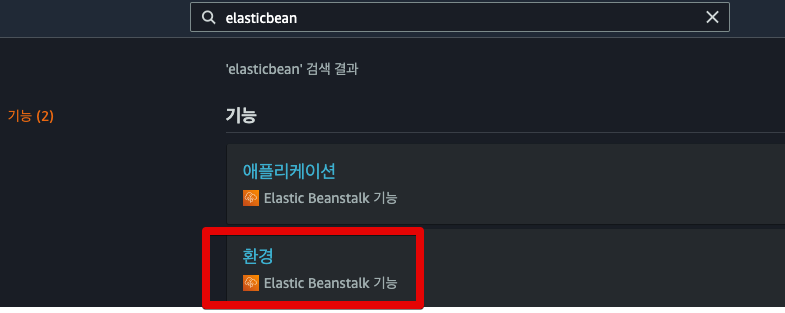
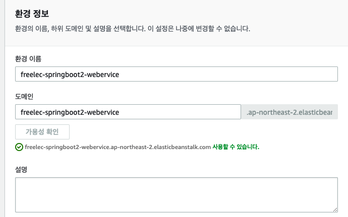
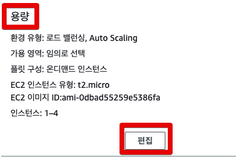
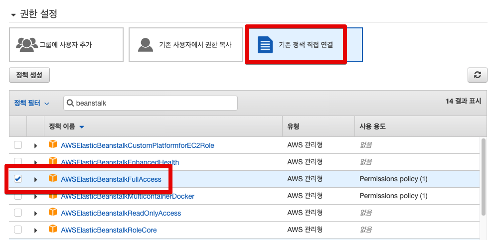
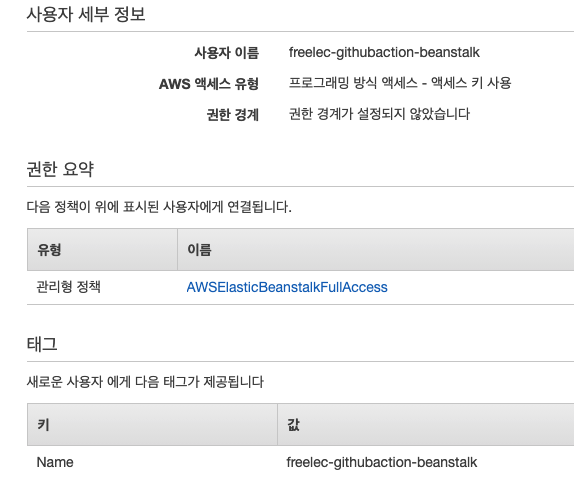

# 2. Github Action & AWS Beanstalk 배포하기 - profile=local로 배포하기

[지난 시간](https://jojoldu.tistory.com/543)에 만들어둔 Github Action을 통해 **profile=local**로 Beanstalk에 배포를 진행해보겠습니다.  
  
profile=local, 즉, 운영 DB정보나 구글&네이버 OAuth 토큰정보 없이 간단하게 테스트용도로만 배포합니다.  
  
실제 운영 배포는 Github Action과 Beanstalk 연동된 환경 (즉, 이번 시간에 설정된 환경)에서 추가 개선건이 될것이며, 이는 다음 시간에 진행할 예정입니다.  
  
지난 시간과 마찬가지로 모든 애플리케이션 코드 (Java & Gradle)는 저의 저서 [스프링 부트와 AWS로 혼자 구현하는 웹 서비스](https://jojoldu.tistory.com/463)를 기반으로 합니다.

> **2020.12월 기준**이기 때문에 시간이 지나면 AWS의 UX 변경이 있을 수 있습니다.  
> 최대한 **키워드** 중심으로 진행할테니, 혹시나 시간이 흘러 보시는 분들은 이점 감안해주시면 됩니다.

## 2-1. AWS Beanstalk 생성하기

AWS Beanstalk 요금 소개

EC2 프리티어 사용 가능?
로드밸런서 사용 가능?

### 2-1-1. AWS Beanstalk 환경 생성하기

AWS 서비스 검색창에서 elasticbeanstalk을 검색합니다.



대시보드에 보이는 **새 환경 생성** 버튼을 클릭합니다.


환경에서는 **웹 서버 환경**을 선택합니다.


일반적으로 Beasntalk의 환경은 위 화면처럼 2가지로 나뉘는데요.

* 웹 서버 환경
  * 기존에 EC2를 사용하던 방식과 크게 다르지 않습니다.
  * 일반적인 웹 서버를 할당 받을 때 사용하면 됩니다.
* 작업자 환경 (Worker environments)
  * 웹 서버 환경에 **메세지 큐 (SQS) 수신이 가능한 리스너 데몬**이 별도 구축된 환경 입니다.
  * 보통의 HTTP API 처리가 아닌 프로세스들(배치/메시지워커 등)을 위한 환경입니다.
  * [참고](https://docs.aws.amazon.com/ko_kr/elasticbeanstalk/latest/dg/using-features-managing-env-tiers.html)

여기서 저희는 일반적인 웹 서비스를 구축하니 **웹 서버 환경**을 선택하고 넘어갑니다.  
  
Beanstalk 생성을 위한 기본정보들을 차례로 등록합니다.


보통은 애플리케이션 이름과 환경 이름을 별도로 구분하지만, 여기서는 하나로 통일해서 진행하겠습니다.  
(별도로 추가 환경 구성할 일이 없기 때문입니다.)  
  
마찬가지로 도메인명 역시 동일하게 맞추어 줍니다.



플랫폼은 관리형 플랫폼을 선택하여 **Java 8** 을 선택합니다.


[Corretto](https://aws.amazon.com/ko/corretto/) 란 AWS에서 지원하는 무료로 사용할 수 있는 Open Java Development Kit(OpenJDK)의 멀티플랫폼 배포판입니다.  
  
같은 JDK라면 Java 11을 선택하면 안되냐고 하실 수도 있는데요.  
  
이 시리즈의 애플리케이션 코드는 모두 **Java 8**을 기본으로 합니다.  
Java 11에서 잘 돌아가는지 검증이 안되어있기 때문에 선택하지 않습니다.

> Java 9부터 [Jigsaw](https://greatkim91.tistory.com/197)가 적용되어, 일반적으로 사용할 수 있던 여러 기본 jar 패키지들을 추가 옵션을 넣어야만 쓸 수 있도록 변경되었습니다.  

마지막은 절대 **환경 생성을 선택하시면 안됩니다**.  
**무중단 배포를 위한 설정** 작업이 추가로 필요합니다.  
그래서 화면 아래와 같이 **추가 옵션 구성**을 선택합니다.


### 2-1-2. 추가 옵션 구성

Beanstalk의 추가 옵션을 차례로 설정합니다.  
  
먼저 최상단에 사전 설정으로 되어있는 부분을 **사용자 지정 구성**으로 변경합니다.  
  


단일 인스턴스 등의 옵션으로 설정할 경우 **로드 밸런서**를 설정할 수 없어 **Beanstalk으로 무중단 배포**를 할 수가 없습니다.  
그러니 꼭 사용자 지정 구성으로 진행합니다.  
  
이제 각 항목별로 설정을 해보겠습니다.

#### 인스턴스


책 p.239에서 설정한 보안그룹을 선택합니다.


#### 용량




### 롤링 업데이트와 배포


#### 보안


만약 pem키를 한번도 생성해보신적 없다면 (즉, EC2 생성을 한번도 못해봤거나, key가 분실된 경우) [이 글](https://jojoldu.tistory.com/540)을 참고하여 수동으로 pem키를 생성하시면 됩니다. 

#### 로드 밸런서


## IAM 인증키 Github Action에서 사용하기


### IAM 인증키 발급받기








### IAM 인증키 Github Action 스크립트에 등록하기

```yaml
- name: Deploy to EB
    uses: einaregilsson/beanstalk-deploy@v14
    with:
    aws_access_key: ${{ secrets.AWS_ACCESS_KEY_ID }}
    aws_secret_key: ${{ secrets.AWS_SECRET_ACCESS_KEY }}
    application_name: MyApplicationName
    environment_name: MyApplication-Environment
    version_label: 12345
    region: ap-northeast-2
    deployment_package: deploy.zip
```

```yaml
name: freelec-springboot2-webservice

on:
  push:
    branches:
      - version/2020-12-11 # push되면 실행될 브랜치를 선택합니다. ex) master (저는 version/2020-12-11 브랜치로 지정)
  workflow_dispatch: # 수동 실행

jobs:
  build:
    runs-on: ubuntu-latest
    steps:
        - name: Checkout
            uses: actions/checkout@v2

        - name: Set up JDK 1.8
            uses: actions/setup-java@v1.4.3
            with:
            java-version: 1.8

        - name: Grant execute permission for gradlew
            run: chmod +x ./gradlew
            shell: bash

        - name: Build with Gradle
            run: ./gradlew clean build
            shell: bash

        - name: Generate deployment package
            run: |
            mkdir -p deploy
            cp build/libs/*.jar deploy/application.jar
            cp Procfile deploy/Procfile
            cp -r .ebextensions deploy/.ebextensions
            cd deploy && zip -r deploy.zip .

        - name: Deploy to EB
            uses: einaregilsson/beanstalk-deploy@v14
            with:
            aws_access_key: ${{ secrets.AWS_ACCESS_KEY_ID }}
            aws_secret_key: ${{ secrets.AWS_SECRET_ACCESS_KEY }}
            application_name: MyApplicationName
            environment_name: MyApplication-Environment
            version_label: 12345
            region: ap-northeast-2
            deployment_package: deploy.zip
```


[](https://github.com/marketplace/actions/beanstalk-deploy)


## Github Action과 Beanstalk 연동하기


### application.properties 정리

**application.properties**

```properties
spring.profiles.active=local
spring.jpa.properties.hibernate.dialect=org.hibernate.dialect.MySQL57Dialect
spring.jpa.properties.hibernate.dialect.storage_engine=innodb
spring.session.store-type=jdbc
```

**application-local.properties**

```properties
spring.jpa.show_sql=true
spring.jpa.properties.hibernate.dialect=org.hibernate.dialect.MySQL57Dialect
spring.jpa.properties.hibernate.dialect.storage_engine=innodb
spring.datasource.hikari.jdbc-url=jdbc:h2:mem:testdb;MODE=MYSQL
spring.datasource.hikari.username=sa

spring.h2.console.enabled=true
spring.session.store-type=jdbc

# Test OAuth

spring.security.oauth2.client.registration.google.client-id=test
spring.security.oauth2.client.registration.google.client-secret=test
spring.security.oauth2.client.registration.google.scope=profile,email
```

**application-local-real.properties**

```properties
spring.profiles.include=oauth
spring.jpa.show_sql=true
spring.jpa.properties.hibernate.dialect=org.hibernate.dialect.MySQL57Dialect
spring.jpa.properties.hibernate.dialect.storage_engine=innodb
spring.datasource.hikari.jdbc-url=jdbc:h2:mem:testdb;MODE=MYSQL
spring.datasource.hikari.username=sa

spring.h2.console.enabled=true
spring.session.store-type=jdbc
```


```bash
vim /var/log/eb-engine.log
```