# 2. Github Action & AWS Beanstalk 배포하기 - profile=local로 배포하기

[지난 시간](https://jojoldu.tistory.com/543)에 만들어둔 Github Action을 통해 **profile=local**로 Beanstalk에 배포를 진행해보겠습니다.  
  
profile=local, 즉, 운영 DB정보나 구글&네이버 OAuth 토큰 정보 없이 간단하게 테스트 용도로만 배포할 예정입니다.  
  
실제 운영 배포는 다음 시간에 진행할 예정입니다.  
Github Action과 Beanstalk 연동된 환경 (즉, 이번 시간에 설정된 환경)를 구성하고 이를 기반으로 개선하는 과정으로 진행할 예정입니다. 
  
지난 시간과 마찬가지로 모든 애플리케이션 코드 (Java & Gradle)는 저의 저서 [스프링 부트와 AWS로 혼자 구현하는 웹 서비스](https://jojoldu.tistory.com/463)를 기반으로 합니다.

> **2020.12월 기준**이기 때문에 시간이 지나면 AWS의 UX 변경이 있을 수 있습니다.  
> 최대한 **키워드** 중심으로 진행할테니, 혹시나 시간이 흘러 보시는 분들은 이점 감안해주시면 됩니다.

## 1. AWS Beanstalk 생성하기

저번 시간에도 간략하게 소개 드렸지만, AWS Beanstalk은 AWS에 지원하는 PaaS (Platform as a Service) 입니다.  
  
기존에 EC2를 직접 구성하고, Code Deploy를 통해 배포환경을 구성하고, 로드밸런서를 연결하고, 오토스케일링 그룹을 직접 생성해서 연결하는 등의 모든 행위가 이 Beanstalk에서는 자동으로 이루어지는데요.  
  
이로인해서 개발자는 코드를 업로드하기만 하면 Elastic Beanstalk가 프로비저닝, 로드 밸런싱, Auto Scaling부터 시작하여 애플리케이션 상태 모니터링에 이르기까지 배포를 자동으로 처리합니다.  

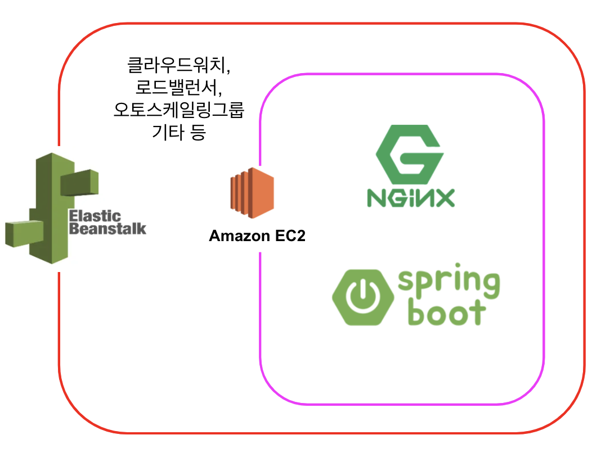

다만, 이렇게 자동으로 해주는 형태로 인해서 **요금** 걱정을 하실 수가 있는데요.  
Beanstalk는 추가 비용 없이 구성한 AWS 리소스에 대해서만 요금을 지불하면 됩니다.  


([AWS 공식 문서](https://aws.amazon.com/ko/elasticbeanstalk/pricing/))  
  
이번에 저희가 사용할 AWS Beanstalk의 서비스는 2가지입니다.

* EC2
* LoadBalancer
  
아직 계정이 프리티어시라면 두 서비스 모두 월 750시간까지 무료이니 걱정 없이 실습을 진행하시면 됩니다.  
  
자 그럼 실제로 하나씩 구성해보겠습니다.

### 1-1. AWS Beanstalk 환경 생성하기

AWS 서비스 검색창에서 elasticbeanstalk을 검색합니다.


대시보드에 보이는 **새 환경 생성** 버튼을 클릭합니다.


환경에서는 **웹 서버 환경**을 선택합니다.

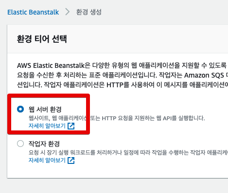

일반적으로 Beasntalk의 환경은 위 화면처럼 2가지로 나뉘는데요.

* 웹 서버 환경
  * 기존에 EC2를 사용하던 방식과 크게 다르지 않습니다.
  * 일반적인 웹 서버를 할당 받을 때 사용하면 됩니다.
* 작업자 환경 (Worker environments)
  * 웹 서버 환경에 **메세지 큐 (SQS) 수신이 가능한 리스너 데몬**이 별도 구축된 환경 입니다.
  * 보통의 HTTP API 처리가 아닌 프로세스들(배치/메시지워커 등)을 위한 환경입니다.
  * [참고](https://docs.aws.amazon.com/ko_kr/elasticbeanstalk/latest/dg/using-features-managing-env-tiers.html)

여기서 저희는 일반적인 웹 서비스를 구축하니 **웹 서버 환경**을 선택하고 넘어갑니다.  
  
Beanstalk 생성을 위한 기본정보들을 차례로 등록합니다.

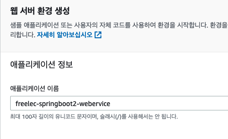

보통은 애플리케이션 이름과 환경 이름을 별도로 구분하지만, 여기서는 하나로 통일해서 진행하겠습니다.  
(별도로 추가 환경 구성할 일이 없기 때문입니다.)  
  
마찬가지로 도메인명 역시 동일하게 맞추어 줍니다.


플랫폼은 관리형 플랫폼을 선택하여 **Java 8** 을 선택합니다.

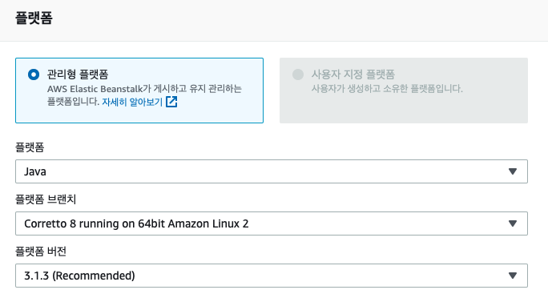

[Corretto](https://aws.amazon.com/ko/corretto/) 란 AWS에서 지원하는 무료로 사용할 수 있는 Open Java Development Kit(OpenJDK)의 멀티플랫폼 배포판입니다.  
  
같은 JDK라면 Java 11을 선택하면 안되냐고 하실 수도 있는데요.  
  
이 시리즈의 애플리케이션 코드는 모두 **Java 8**을 기본으로 합니다.  
Java 11에서 잘 돌아가는지 검증이 안되어있기 때문에 선택하지 않습니다.

> Java 9부터 [Jigsaw](https://greatkim91.tistory.com/197)가 적용되어, 일반적으로 사용할 수 있던 여러 기본 jar 패키지들을 추가 옵션을 넣어야만 쓸 수 있도록 변경되었습니다.  

마지막은 절대 **환경 생성을 선택하시면 안됩니다**.  
**무중단 배포를 위한 설정** 작업이 추가로 필요합니다.  
그래서 화면 아래와 같이 **추가 옵션 구성**을 선택합니다.


### 1-2. 추가 옵션 구성

Beanstalk의 추가 옵션을 차례로 설정합니다.  
  
먼저 최상단에 사전 설정으로 되어있는 부분을 **사용자 지정 구성**으로 변경합니다.  
  


단일 인스턴스 등의 옵션으로 설정할 경우 **로드 밸런서**를 설정할 수 없어 **Beanstalk으로 무중단 배포**를 할 수가 없습니다.  
그러니 꼭 사용자 지정 구성으로 진행합니다.  
  
이제 각 항목별로 설정을 해보겠습니다.

#### 인스턴스

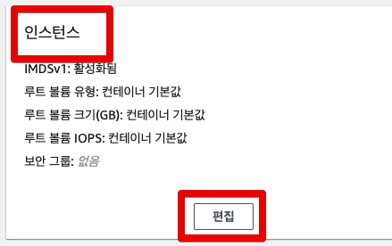

SSH 접속과 HTTP 접근이 가능하도록 보안그룹을 선택합니다.

> 책 p.239에서 설정한 보안그룹이며, 생성을 해본적이 없으신 분들은 EC2로 가서 보안그룹 생성후 진행하시면 됩니다.


아래와 같이 보안그룹이 정상적으로 선택된 것을 확인하시면 됩니다.


#### 용량

용량은 오토스케일링 그룹을 이야기합니다.  
즉, 이 Beanstalk으로 운영될 인스턴스의 수를 몇대로 할 것인지 정한다고 보시면 되는데요.  
  


프리티어로 사용할 것이기 때문에 1대로 유지합니다.

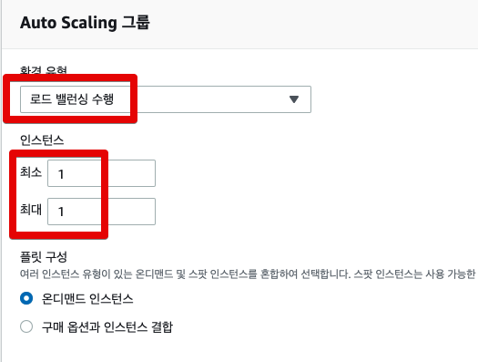

최대값을 1개 초과해서 적으시면 많은 트래픽이 들어올 경우 서버가 자동으로 증설되어 프리티어를 초과한 비용이 부담됩니다.  

> 현재 설정으로 하시면 많은 트래픽이 오면 서버가 죽는 한이 있어도, 증설되진 않습니다.

### 롤링 업데이트와 배포


#### 보안


만약 pem키를 한번도 생성해보신적 없다면 (즉, EC2 생성을 한번도 못해봤거나, key가 분실된 경우) [이 글](https://jojoldu.tistory.com/540)을 참고하여 수동으로 pem키를 생성하시면 됩니다. 

#### 로드 밸런서

마지막으로 로드밸런서까지 선택합니다.


기존에 많이 사용한 로드밸런서는 Elastic Load Balancer (이하 ELB) 로 불리기도 했던 Class Load Balancer인데요.  
  
ELB의 경우 먼저 나온 로드밸런서다보니 이후에 나온 Application Load Balancer (이하 ALB) 에 비해 **성능과 기능**면에서 부족한점이 많습니다. 

> 로드밸런서 라우팅 기능이 ELB는 거의 없다시피하며, ALB는 다양한 라우팅 기능을 지원합니다.

다만, 먼저 나왔다보니 그만큼 국내 자료가 많긴하지만, 최근 대부분의 서비스는 ALB를 선택하다보니 저희 역시 ALB를 선택하겠습니다.  

> 대규모 서비스를 운영하다보면 서버의 하드웨어 지표는 무리가 없는데 로드밸런서가 못버텨서 장애가 나기도 합니다.  
> 이를 대응하기 위해 ELB에서는 미리 충분한 대역폭을 늘려놓을 수 있도록 pre-warming 이라는 작업을 AWS측으로 요청할 수 있는데요.  
> 예정된 이벤트의 경우에는 이렇게 pre-warming이 가능한데, 갑작스런 트래픽에 관해서는 대응이 어려웠습니다.  
> 반면 ALB의 경우 이런 갑작스런 트래픽에 관해서도 대응이 되기 때문에 선택하지 않을 이유가 없습니다.

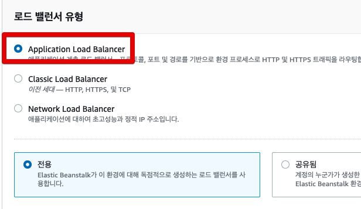

### 1-3. 생성

1-2의 모든 설정들이 끝나면 환경 생성 버튼을 클릭합니다.  

애플리케이션 코드는 **샘플 애플리케이션**을 선택합니다.  
  
그럼 아래와 같이 생성 로그가 출력 됩니다.

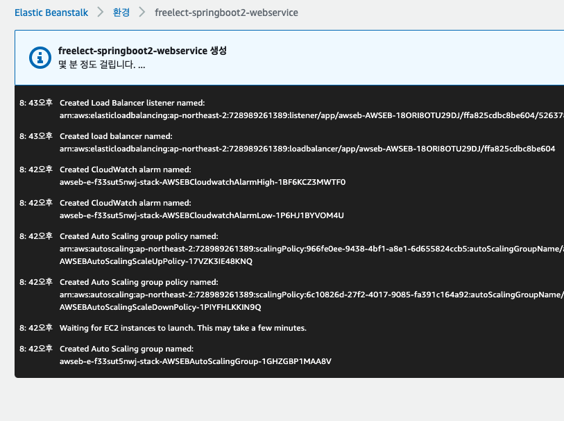

생성이 다 끝나시면 아래와 같이 애플리케이션과 환경을 볼 수 있습니다.

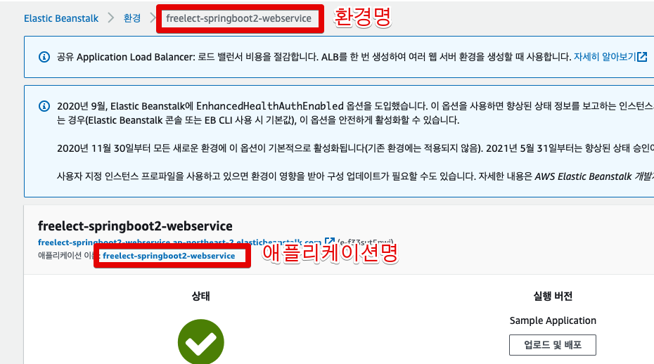

참고로 위 생성 그림만 보면 Elastic Benastalk 의 구조를 환경 하위에 애플리케이션이 있다고 오해하실 수도 있으실텐데요.  
  
실제로는 애플리케이션 하위에 환경이 있습니다.  
이는 Elastic Benastalk은 컨셉상 하나의 애플리케이션을 호스팅하는데요.  
그러다보니 개발환경/스테이지환경/프로덕션환경 등등 여러 환경으로 나뉠수 있도록 **환경**이라는 단위가 있는 것입니다.  
  
그래서 실제로는 애플리케이션이 상위에, 환경이 하위에 있다고 보시면 됩니다.  
  
자 그럼 Beanstalk 환경이 생성되는 동안 저희는 Github Action 작업을 진행하겠습니다.

## 2. IAM 인증키 Github Action에서 사용하기

같은 AWS 서비스가 아닌 외부 서비스인 Github Action에서는 TravisCI와 마찬가지로 AWS 서비스에 명령을 줄 수 있는 권한을 받아야 합니다.  
  
> [Travis CI와 AWS ElasticBeanstalk 연동하기](https://jojoldu.tistory.com/317)

외부 서비스가 AWS 서비스에 대한 명령 권한을 받는 방법으로는 IAM 사용자를 이용한 인증키 (accessKey, secretKey)가 있습니다.  
  
그래서 해당 인증키를 먼저 발급 받겠습니다.

### 2-1. IAM 인증키 발급받기

AWS Beanstalk 생성 페이지를 두고, 새 페이지를 열어서 ```iam```을 검색해봅니다.  
그럼 아래와 같이 IAM 서비스가 나오는데요.  
해당 페이지로 이동합니다.

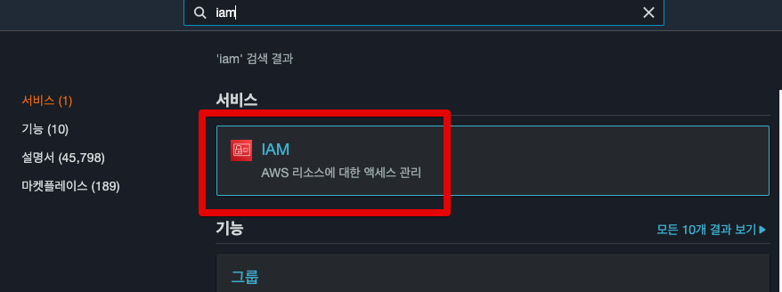

좌측 사이드바의 **사용자** 항목을 선택합니다.  

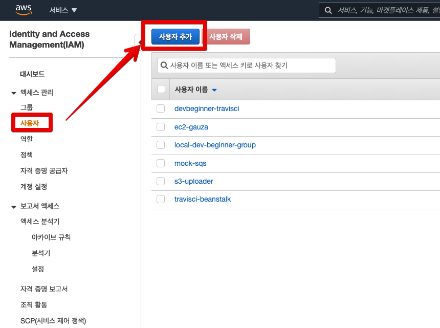

accessKey, secretKey를 발급받을 수 있는 사용자 정보를 생성합니다.  


기존 정책 연결에서는 **AWS Beanstalk의 Access**를 할당 받습니다.


여러 사용자들 사이에서 식별 가능하도록 태그에는 Name을 지정합니다.

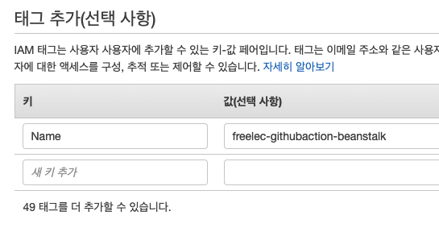

생성 되시면 아래와 같이 accessKey와 secretKey가 생성됩니다.


해당 내용을 복사를 하신 뒤 해당 프로젝트의 Github 페이지로 이동합니다.  
  
Github 에서 상단 탭을 보시면 **Settings**가 보입니다.  
클릭하신뒤, 좌측 사이드바의 **Secrets** -> **New Repository secret** 버튼을 차례로 클릭합니다.

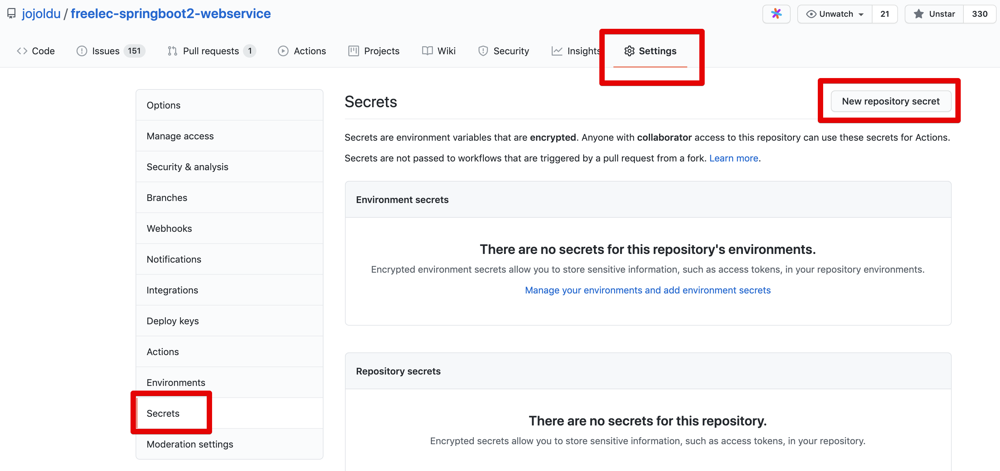

그럼 아래와 같이 생성된 IAM 인증키 항목을 등록하시면 되는데요.  

* AWS_ACCESS_KEY_ID: IAM 엑세스키 ID
* AWS_SECRET_ACCESS_KEY: IAM 비밀 엑세스 키

로 채워주시면 됩니다.  
  
**AWS_ACCESS_KEY_ID**


**AWS_SECRET_ACCESS_KEY**

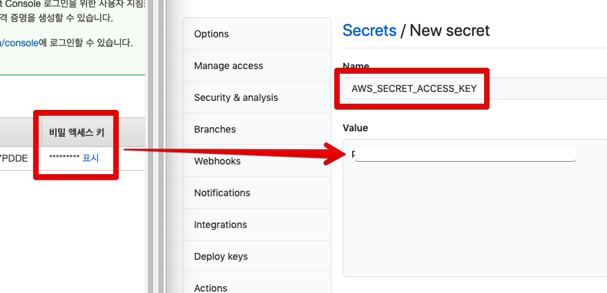

다 생성 되시면 아래와 같이 secrets 항목에 2개의 키가 추가된 것을 확인할 수 있습니다.


자 그럼 위에서 등록한 key들을 Github Action에서 사용할 수 있도록 스크립트에 코드를 심어보겠습니다.

### 2-2. Github Action 스크립트 수정하기


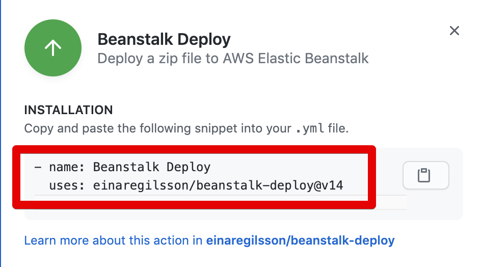

```yaml
- name: Deploy to EB
    uses: einaregilsson/beanstalk-deploy@v14
    with:
    aws_access_key: ${{ secrets.AWS_ACCESS_KEY_ID }}
    aws_secret_key: ${{ secrets.AWS_SECRET_ACCESS_KEY }}
    application_name: MyApplicationName
    environment_name: MyApplication-Environment
    version_label: 12345
    region: ap-northeast-2
    deployment_package: deploy.zip
```

```yaml
name: freelec-springbootwebservice

on:
  push:
    branches:
      - version/2020-111 # push되면 실행될 브랜치를 선택합니다. ex) master (저는 version/2020-111 브랜치로 지정)
  workflow_dispatch: # 수동 실행

jobs:
  build:
    runs-on: ubuntu-latest
    steps:
        - name: Checkout
            uses: actions/checkout@v2

        - name: Set up JDK 1.8
            uses: actions/setup-java@v1.4.3
            with:
            java-version: 1.8

        - name: Grant execute permission for gradlew
            run: chmod +x ./gradlew
            shell: bash

        - name: Build with Gradle
            run: ./gradlew clean build
            shell: bash

        - name: Generate deployment package
            run: |
            mkdir -p deploy
            cp build/libs/*.jar deploy/application.jar
            cp Procfile deploy/Procfile
            cp -r .ebextensions deploy/.ebextensions
            cd deploy && zip -r deploy.zip .

        - name: Deploy to EB
            uses: einaregilsson/beanstalk-deploy@v14
            with:
            aws_access_key: ${{ secrets.AWS_ACCESS_KEY_ID }}
            aws_secret_key: ${{ secrets.AWS_SECRET_ACCESS_KEY }}
            application_name: MyApplicationName
            environment_name: MyApplication-Environment
            version_label: 12345
            region: ap-northeast-2
            deployment_package: deploy.zip
```


[](https://github.com/marketplace/actions/beanstalk-deploy)


## 3. Github Action으로 Beanstalk 배포하기


### 3-1. application.properties 정리

**application.properties**

```properties
spring.profiles.active=local
spring.jpa.properties.hibernate.dialect=org.hibernate.dialect.MySQL57Dialect
spring.jpa.properties.hibernate.dialect.storage_engine=innodb
spring.session.store-type=jdbc
```

**application-local.properties**

```properties
spring.jpa.show_sql=true
spring.jpa.properties.hibernate.dialect=org.hibernate.dialect.MySQL57Dialect
spring.jpa.properties.hibernate.dialect.storage_engine=innodb
spring.datasource.hikari.jdbc-url=jdbc:h2:mem:testdb;MODE=MYSQL
spring.datasource.hikari.username=sa

spring.h2.console.enabled=true
spring.session.store-type=jdbc

# Test OAuth

spring.security.oauth2.client.registration.google.client-id=test
spring.security.oauth2.client.registration.google.client-secret=test
spring.security.oauth2.client.registration.google.scope=profile,email
```

**application-local-real.properties**

```properties
spring.profiles.include=oauth
spring.jpa.show_sql=true
spring.jpa.properties.hibernate.dialect=org.hibernate.dialect.MySQL57Dialect
spring.jpa.properties.hibernate.dialect.storage_engine=innodb
spring.datasource.hikari.jdbc-url=jdbc:h2:mem:testdb;MODE=MYSQL
spring.datasource.hikari.username=sa

spring.h2.console.enabled=true
spring.session.store-type=jdbc
```


### 4-2. 


```bash
vim /var/log/eb-engine.log
```