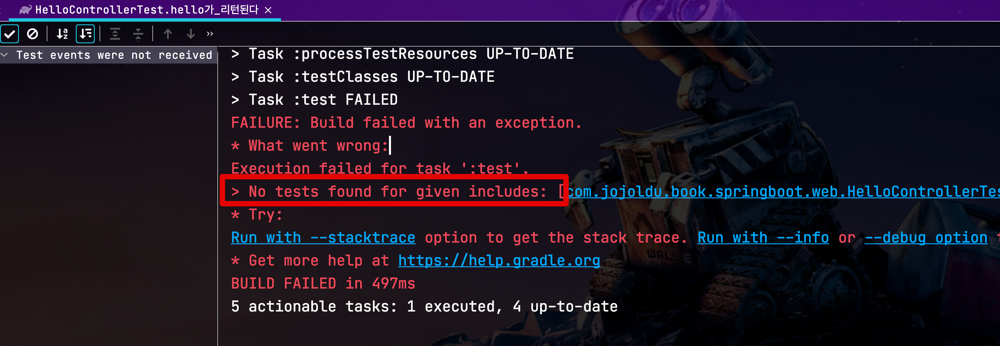

# 스프링 부트와 AWS로 혼자 구현하는 웹 서비스 (2020.12.12)

* Spring Boot 2.4.1
* Gradle 6.7.1
* IntelliJ IDEA 2020.3
* Junit5

## 0. 기존에 구성했다면

## 1. build.gradle

```groovy
plugins {
    id 'org.springframework.boot' version '2.4.1' // RELEASE 삭제
    id 'io.spring.dependency-management' version '1.0.10.RELEASE'
    id 'java'
}

group 'com.jojoldu.book'
version '1.0.4-SNAPSHOT-'+new Date().format("yyyyMMddHHmmss")
sourceCompatibility = 1.8   

repositories {
    mavenCentral()
    jcenter()
}

// for Junit 5
test {
    useJUnitPlatform()
}

dependencies {
    implementation('org.springframework.boot:spring-boot-starter-web')
    implementation('org.springframework.boot:spring-boot-starter-mustache')

    // lombok
    implementation('org.projectlombok:lombok')
    annotationProcessor('org.projectlombok:lombok')
    testImplementation('org.projectlombok:lombok')
    testAnnotationProcessor('org.projectlombok:lombok')

    implementation('org.springframework.boot:spring-boot-starter-data-jpa')
    implementation("org.mariadb.jdbc:mariadb-java-client")
    implementation('com.h2database:h2')

    implementation('org.springframework.boot:spring-boot-starter-oauth2-client')
    implementation('org.springframework.session:spring-session-jdbc')

    testImplementation('org.springframework.boot:spring-boot-starter-test')
    testImplementation("org.springframework.security:spring-security-test")
}
```

## 2. Junit

Mac

* CMD + Shift + R

Windows/Linux

* Ctrl + Shift + R

**ReplaceAll**


### @Test

### @RunWith

### SpringRunner

**as-is**

```java
org.springframework.test.context.junit4.SpringRunner
```

**to-be**

```java
org.springframework.test.context.junit.jupiter.SpringExtension
```

### @After

### @Before

```java
org.junit.Before
```

```java
org.junit.jupiter.api.BeforeEach
```

### 주의

```java
No tests found for given includes
```



build.gradle에 아래 옵션이 빠진건 아닌지 다시 1번의 build.gradle 옵션을 확인해봅니다.

```groovy
test {
    useJUnitPlatform()
}
```