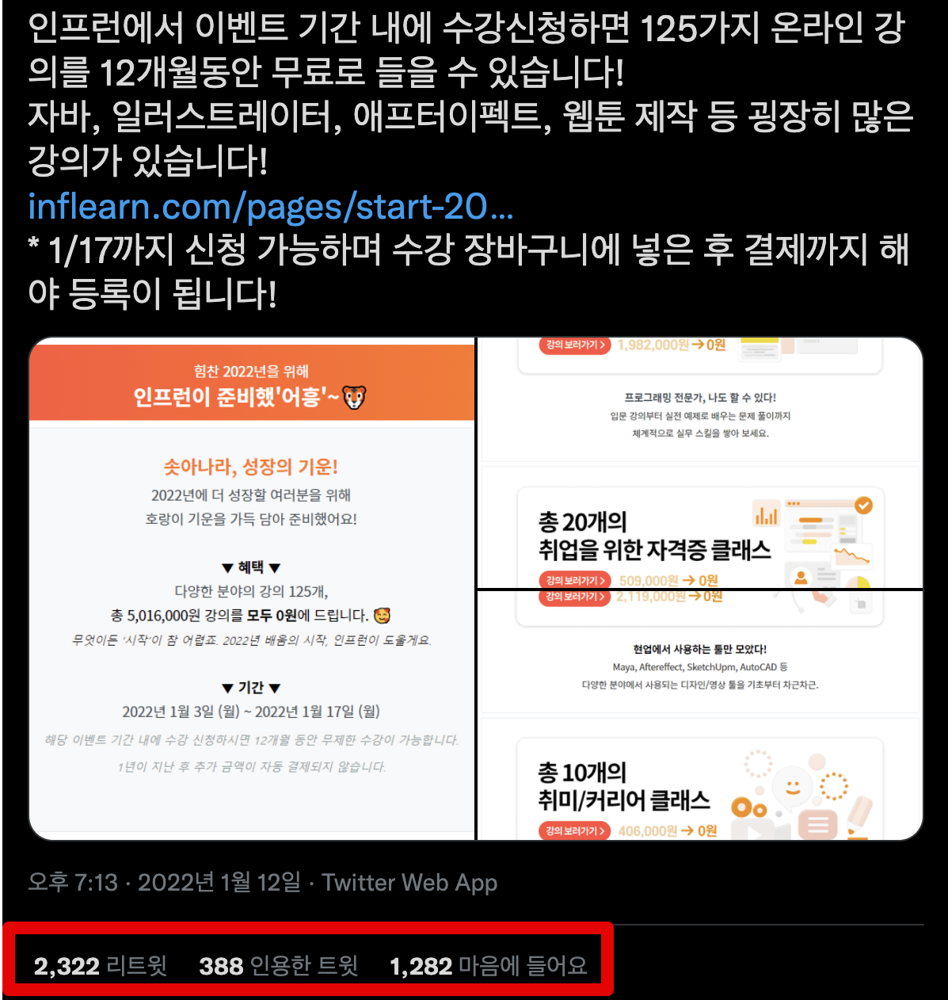
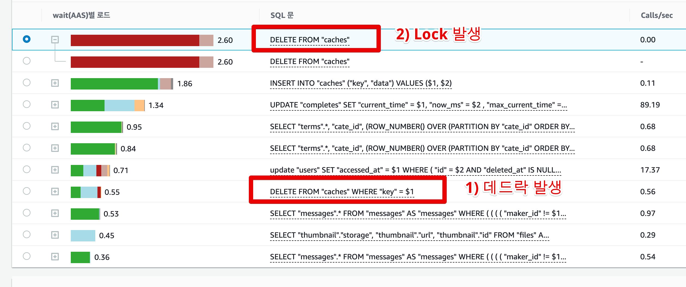
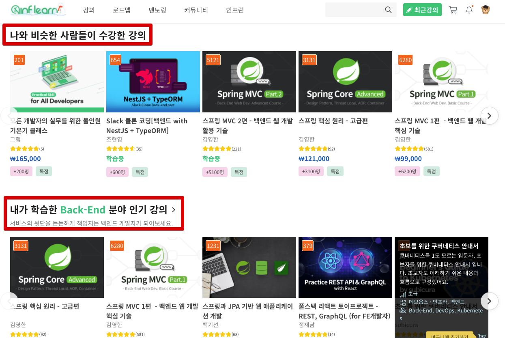
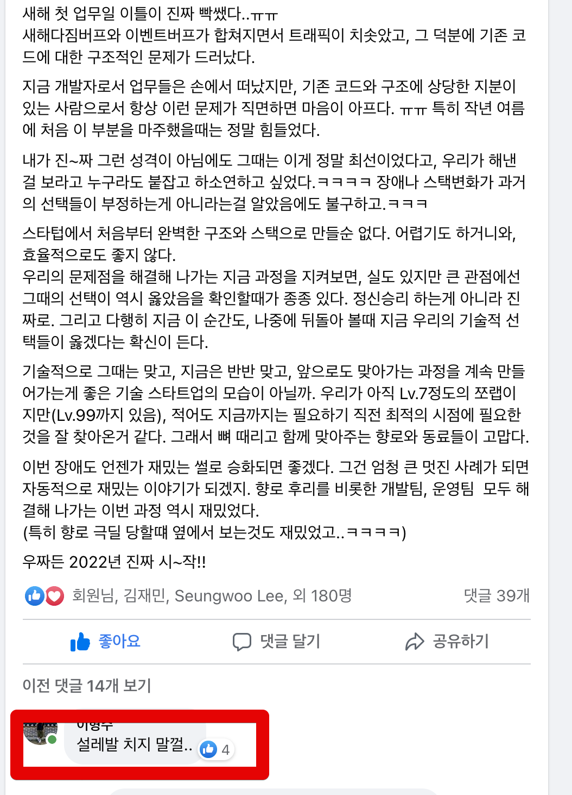
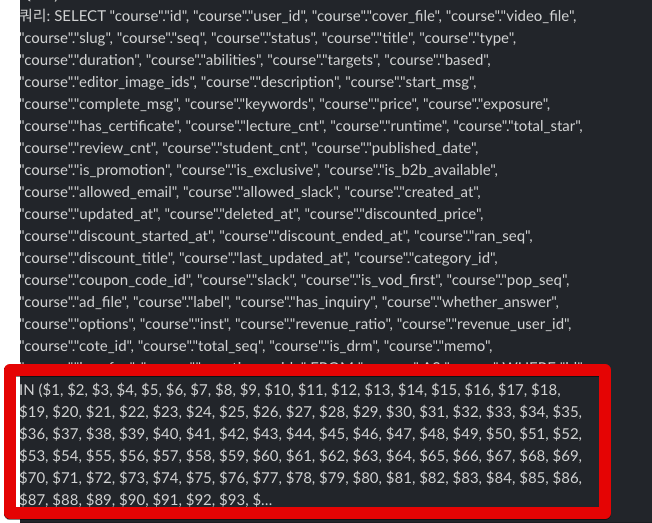
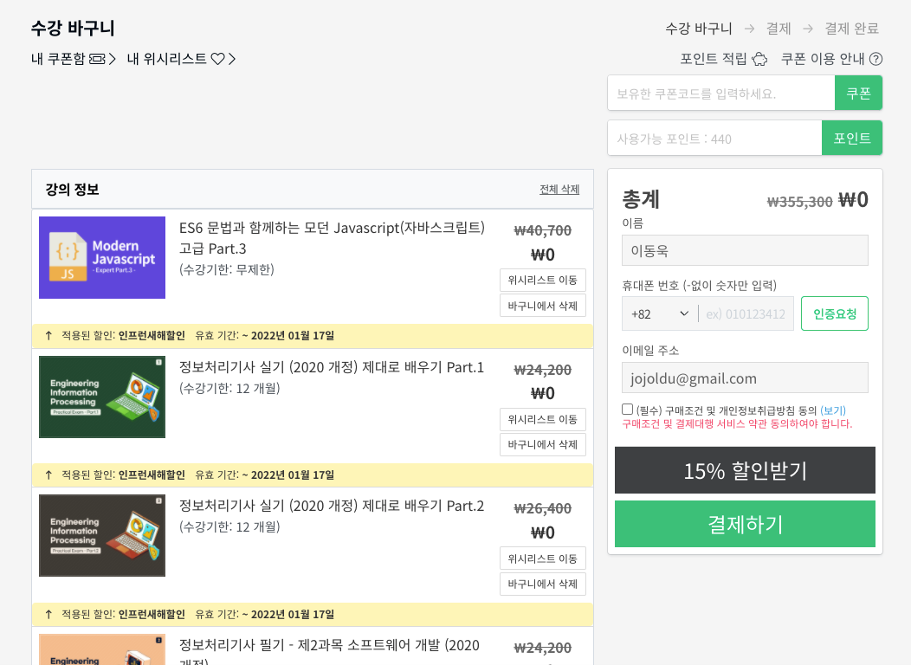
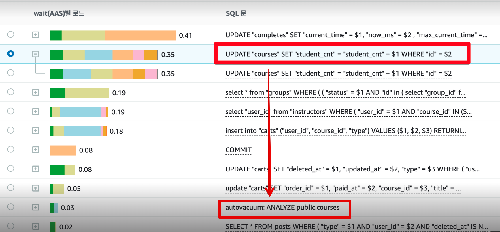

# 2022년 1월 100% 할인 이벤트 장애 회고

안녕하세요 인프런의 향로입니다.  
인프런 서비스는 2022년 1월 3일 ~ 17일까지 지속적으로 서비스를 사용할 수 없는, 역대급 장애가 발생습니다.  

이 포스팅을 통해 서버 문제가 발생한 원인과 이를 해소한 과정을 투명하게 공유드리려고 합니다.  
  
조금은 적절한 짤과 함께 재미난 형태로 풀고 싶었지만,  
막상 해당 장애를 통해 불편을 느끼신 분들에게는 오히려 예의가 아닐수도 있다는 생각에 조금은 진지한 형태로 글을 작성하게 되었습니다.  

> 다시 한번 서비스 사용에 불편을 드려 정말 죄송합니다. 

# 1. 발단

2022년을 맞이해서 인프런에서는 [특정 강의를 100% 할인 이벤트](https://www.inflearn.com/pages/start-20220103)를 진행했습니다.  

다양한 분야의 **강의 125개**, **총 5,016,000원** 강의를 **모두 0원**에 아래 기간동안 등록할 수 있는 이벤트였습니다.

* 첫번째 이벤트: 2022년 1월 3일 (월) ~ 2022년 1월 17일 (월)
* 두번째 이벤트: 2022년 1월 18일 (화) ~ 2022년 1월 24일 (월)


이 이벤트는 저희의 예상을 벗어날정도로 엄청난 바이럴이 발생했는데요.




트위터에서만 **1만 리트윗이상**이 발생하고, 그 외 디시인사이드, 루리웹, 클리앙등 여러 IT 커뮤니티에서도 공유가 되어 **평소 대비 5~20배의 트래픽**이 발생했습니다.  
  
그 덕에 **7일만에 76,730의 신규 가입자**분들, 전년 대비 **1,855**%라는 놀라운 수치를 달성하기도 했습니다.


반면, 그만큼의 트래픽이 발생했기 때문에 장애가 지속적으로 발생했는데요.  
아래는 **시간별 트랜잭션수** 인데, 빨간박스가 평소대비 높은 수치를 달성한 시간이고 **모두 장애가 발생**하였습니다.


(1월 3일 ~ 1월 8일)


(1월 16일 ~ 1월 21일)  
    
이 수치는 그간 저희 서비스에서 겪지 못했던 수준이였고, 앞선 이벤트들에서도 만나지 못했던 수치였습니다.  
  
그러다보니 1월 3일, 4일, 7일, 17일 등 **총 4일 동안 오전 9시, 오후 10시**가 되면 거의 서비스가 불가능할정도로 불안정한 상태를 유지하였습니다.    
(그래서 **총 6번의 서비스 장애**가 발생했습니다.)  
  
단순하게보면 트래픽을 통한 서비스 장애라고 볼 수 있겠습니다.  
하지만 여기까지 보신 분들이라면 의아한 점이 몇가지 있으실텐데요.

* 아무리 폭증한 트래픽이라하더라도 쿠팡/배민 등에 비하면 작은 트래픽일텐데, 클라우드 서비스의 **스케일아웃/스케일업**도 안했었나?
* 이벤트 준비하면서 **성능 테스트**도 미리 안했나?
* 1월 8일 장애 이후 17일 장애까지는 10일간의 시간이 있는데, **그동안 대응안하고 뭐했나**?

각 타임라인을 보면서 이런 의문점에 대해서 하나씩 답변드리겠습니다.

> 저희의 면죄부를 이야기한다기 보다는, 하나의 작은 스타트업이 기술 부채로 인해 발생한 서비스 장애의 원인을 어떻게 찾고, 이를 해결하기 위한 임시 방안, 전반적인 근본 원인을 조사하는 과정을 소개드리는 것으로 생각해주시면 좋을것 같습니다.
 
# 2. 장애 회고

장애 회고에 대해 말씀드리기 앞서, 현재 인프런 서비스의 구조에 대해서 짧게 소개해드리겠습니다.

## 서버 구조


> Application Load Balancer, ElasticCache (Redis), DynamoDB, AWS Lambda 등도 사용중이지만, 이번 장애와는 무관하기 때문에 위 그림에서는 제외했습니다.

현재 인프런의 경우 **모놀리틱 NodeJS 프로젝트**를 ECS Fargate 에 올려 트래픽에 따라 **10대 ~ 30대**를 유지하고 있습니다.  
이번 장애와 직접적인 영향이 있는 데이터베이스의 경우 **AWS Aurora PostgreSQL 10.16**을 사용중인데요.  

* 1대의 Writer (Master) 
* 2 ~ 7대의 Reader (Replacation) 

대부분의 조회용 쿼리는 Reader DB를 통해 처리하고, 등록/수정/삭제의 요청들은 Writer DB를 통해 처리하면서 적절하게 DB 부하를 분산하고 있었습니다.  

> [Multi Master](https://aws.amazon.com/ko/blogs/korea/building-highly-available-mysql-applications-using-amazon-aurora-mmsr/) 의 경우 아직까지 고려하고 있지는 않습니다.  
> 애초에 서비스별로 별도 DB를 구성하는게 가용성과 성능에 더 효과적이라고 생각하기 때문입니다.

서비스별로 각자의 DB를 갖고 있지 않은 상태이기 때문에, **한 서비스의 장애는 전체 서비스의 장애**로 확장될 수 밖에 없는 구조입니다.  

> 물론 그렇기 때문에 MSA (MicroService Architecture)로 가야한다는 것이 이번 글의 핵심은 아닙니다.  

적절한 서버 대수 (10대 ~ 30대) 와 DB 부하 분산 (총 8대의 DB / Replication 구조) 가 되어있음에도 장애를 만나게 된 이유가 있는데요.   
  
위 내용을 기반으로 지난 1월 3일부터 1월 17일까지 발생했던 서버 문제를 살펴보며 어떤 상황이 발생하고 조치를 취했는지 정리해보겠습니다.

## 1월 3일 장애

이벤트 시작일인 2022년 1월 3일 저녁 8시부터 예상치 못한 규모의 접속량 증가가 발생했습니다.  
그로인해 **오후 8:30분부터 오후 10:00까지** 1시간 30분동안 서비스가 사용불가능할정도로 서비스 지연이 발생했습니다.  
  
이 기간동안의 문제는 **강의 페이지의 관심회사 조회** 기능에서 대량의 슬로우 쿼리가 발생했습니다.


([강의 페이지](https://www.inflearn.com/course/http-%EC%9B%B9-%EB%84%A4%ED%8A%B8%EC%9B%8C%ED%81%AC)를 가보시면 이 강좌를 듣고 있는 분들의 회사 정보를 볼 수 있습니다.)  

해당 조회 API는 실시간으로 가공해서 조회하다보니, 인덱스가 적용이 안된 경우 성능 부하를 줄 수 있는데요.  
해당 쿼리의 지연으로 인해 **빠르게 Node 프로세스의 커넥션이 고갈되어** 이후의 요청들이 모두 대기 상태로 빠지게 됩니다.  
그리고 일정 수치이상을 대기하다가 Node 프로세스들이 강제 종료되는 현상이 발생했습니다.  
ECS 설정을 통해 **빠진 프로세스만큼 다시 프로세스가 추가**되지만, 관심회사 조회 API 외에도 처리하던 **다른 쿼리도 Node 프로세스의 종료로 전부 Cancel** 되어 서비스가 전체적으로 사용이 불가능한 상태가 됩니다.  
  
관심 회사 조회 API의 쿼리중 일부가 인덱스가 적용 안된 것을 로그와 실행계획을 통해 확인후 바로 **인덱스를 추가**해서 이 문제는 일단락 시킬 수 있었습니다.  
  
그렇게 임시조치를 하고 대기중에 또다시 서비스 장애가 시작됩니다.  
앞서 장애로 서비스를 사용못했던 분들 + 본격적으로 퇴근하고 자기개발을 시작하신 고객분들이 함께 유입되기 시작했기 때문인데요.  
    
본격 트래픽이 유입되니 1월 3일 **오후 11:30분부터 1월 4일 새벽 01:30까지** 2시간동안 **Write DB의 CPU가 90% 이상**이 되어 전체 서비스가 사용이 불가능했습니다.  
  


이번 장애의 경우 Writer DB의 부하로 인해 발생했습니다.  
  
이땐 2개의 문제가 겹치게 된 경우였습니다.  

* Redis의 부하를 낮추기 위해 DB로 분산시킨 캐시용 데이터
* Writer DB에서 호출되던 조회용 쿼리

모든 캐시 데이터를 Redis에서 관리하면서 Redis의 부하 문제가 종종 발생했는데요.  
이 문제를 해소하기 위해 일부 캐시 데이터는 DB에서 관리하도록 구성하였습니다.  
  
다만, 초기 캐시 데이터 설계를 잘못하여 **1개 JSON에서 모든 캐시데이터를 관리** 하도록 되어있었습니다.  
그러다보니 DB로 캐시를 분리하는 것 역시 **1개 Row에 보관할 모든 캐시 데이터를 저장**하도록 구성하고 조금씩 개선할 예정이였는데요.    
  
그렇게 적재되던 고용량의 캐시 Row는 (단일건) 결국 캐시 초기화 / 캐시 재생성등의 행위가 발생할때마다 Writer DB에게 큰 부하를 주게 됩니다.  
  
평소에는 큰 문제가 없다가, 이번처럼 사용자수가 증가하여 캐시 초기화 & 재생성이 빈번하게 발생하는 경우 문제가 발생하게 되는데요.  
특히나 **1개 Row에 대한 요청이 겹치다보니 데드락**이슈로 확장되게 됩니다.




아직 **Writer DB에서 처리하는 조회용 쿼리**들의 호출수도 급격히 높아져 Writer DB의 부하를 더욱 심화시켰습니다. 

> 인프런의 경우 **Aurora DB 도입을 작년 여름**에 하여 Writer / Reader DB 쿼리 분산이 일부 쿼리에만 적용된 상태였습니다.  

서비스를 안정화시키는 것이 우선이기에, 당장 조치하기 어려운 캐시 데이터 해체보다는 아래 2가지 작업을 우선적으로 진행합니다. 

* 캐시 초기화 & 재생성 주기 변경
* Writer DB에 부하를 준 조회용 쿼리들만 먼저 Reader DB로 전환

이렇게 1월 3일의 장애를 일단락하고 퇴근을 하게 됩니다.

## 1월 4일 장애

1월 4일 오전 9시가 되자 다시 한번 트래픽이 증가하게 됩니다.  
오전 9시는 많은 분들이 강의 수강을 하는 시간대이다보니, 미리 출근해서 준비를 하고 있었는데요.  
1월 4일 오전9시부터 12시까지 총 **3시간동안** 서비스를 사용할 수 없게 됩니다.  
  
이때의 장애 원인은 **강의 조회 관련 슬로우 쿼리** 때문이였는데요.


(상위 9개의 슬로우 쿼리가 모두 강의 조회)  
  
인프런 내에서는 강의 테이블의 조회 쿼리가 굉장히 많습니다.  
실제 강의 검색 외에도 아래와 같이 **추천형 기능**들이 모두다 강의 테이블을 기반으로 하기 때문입니다.  



이 쿼리들은 당시 모니터링상으로 크게 2가지 문제가 있다고 판단했습니다

* 비효율적인 실행 계획
* 불필요한 조회항목들

> 이때의 해결책은 임시 조치에 가까우며, 실제 근본 원인은 마지막에 찾게 됩니다.

슬로우 쿼리들의 대부분은 **테이블의 컬럼을 변조**하거나 부정조건 (`!=`, `NOT IN` ) 등 인덱스를 사용할 수 없는 형태의 쿼리들로 되어 있었습니다.

```sql
lower("컬럼명") = lower(쿼리파라미터)
```

그러다보니 테이블 스캔 쿼리가 동시에 발생하면서 여러 병목의 원인이 되었습니다.  
  
이외에 **READ IO의 병목**을 주는 쿼리들도 있었습니다.  


일부의 슬로우 강의 조회 쿼리들을 보면 `select *` 로 되어있어 **사용 여부와 관계 없이 모든 컬럼을 조회**하도록 되어있었는데요.  
  
그러다보니 **사용하지도 않는 대용량의 컬럼들도 함께 조회**되었습니다.  
  
이를테면 아래와 같이 강의 본문의 경우 **엄청난 텍스트가 있는 컬럼**입니다.


이 컬럼은 **HTML 태그를 포함**해서 포함하다보니 아래와 같이 수많은 문자열이 포함되어있었습니다.


실제 용량을 측정해보면 해당 컬럼 1개의 값이 **10KB** 나 되는 고용량의 데이터였습니다.


이 2가지 큰 문제들을 바로 개선을 진행했습니다.

* 조회 쿼리 개선
  * 인덱스를 추가하거나 쿼리를 변경해서 인덱스를 사용하도록 개선
  * 개선이 안되는 쿼리라면 차라리 기능 OFF
* `select *` 로 조회되던 컬럼에서 고용량인 강의 소개 컬럼은 모두 제거
  * 실제 해당 기능에서 사용되지 않았기 때문에

원인을 파악하고 문제가 되는 쿼리들을 정리하는데는 모니터링과 슬로우쿼리 알람을 통해 30분도 안되는 짧은 시간이 소요된 반면, 실제 해결까지는 3시간이 소요되었는데요.  
  
이유는 **무분별한 쿼리 추상화** 때문이였습니다.  


(프로젝트에서 사용중인 쿼리들)  
  
쿼리 내용을 전부 문자열 함수/ Hook / 커스텀 이벤트를 사용해서 구성하다보니 **해당 쿼리의 실제 코드를 찾는데 많은 시간을 소모**하게 됩니다.  
  
또한 기존 프로젝트에서는 **타입이 없고, 테스트 코드가 없다보니** 안정감을 가지고 조회 쿼리를 변경하기가 부담스러웠습니다.  
  
그래서 로컬에서 충분한 수동 테스트를 하고 나서야 실제 배포를 진행할 수 있었고, 그로 인해 실제 장애 시간이 더 길어지게 되었습니다.  
  
위 조치사항을 취하고, 서비스가 안정화 되는 것을 확인후 퇴근을 할 수 있었습니다.

## 1월 7일 장애 

1월 4일이 지나고 1월 5일 ~ 6일 양일간에는 더이상 장애가 발생하지 않았습니다.  
그래서 이젠 이벤트를 통한 병목 현상은 모두 해소되었다고 안심하게 되는데요.  
  


(저와 함께 설레발치셨던 대표님 ㅠ)  
  
1월 7일 저녁 9시 30분부터 다시 트래픽이 늘면서 서비스의 지연현상이 시작 됩니다.  






장바구니, 구매완료, 결제페이지 슬로우 쿼리

시간: 2022.01.07 21:30 ~  2022.01.03 22:00 (1시간 30분)

원인: where id in () 에 100개 이상의 ID를 넣어서 인덱스 풀스캔이 발생하여 서비스 장애

결제시 주문서 생성 과정에서 장바구니에 담긴 강의 정보를 가져오고 있음

현재 이벤트 진행중인 무료 강의 125개 한번에 담아서 in 절에 해당 강의들이 모두 담긴 쿼리가 실행


 

장애내용

course 관련 조회 쿼리에서 대량의 3초이상 슬로우 쿼리 발생

Reader DB 부하 심화

select * from course 와 관련된 쿼리들 body, text_body 컬럼 제거

슬로우 쿼리 감소

앞서 Reader DB 응답 지연으로 Node JS 애플리케이션 좀비 프로세스

헬스체크시 DB 상태 체크 로직을 제외해서 Node 자체가 죽지는 않음

다만, DB가 복구되어도 Node와 DB간 Connection이 재연결 안됨

NodeJS 서버들 전체 재투입


해결
120건씩 in 에 담기는 것들은 모두 20건씩 나눠 담아서 병렬 쿼리 수행

후속조치
결제페이지(카트리스트 API 포함), 결제완료페이지, 결제내역상세페이지, 대시보드페이지, 내 수강 목록페이지 등에서
다른 데이터(cart/voucher)로 시작하여 id 기반으로 강의를 조회하는 쿼리에 body, text_body 컬럼 제외

장바구니 페이지, 주문서 생성 API, 구매완료 페이지 등에서 조회되는 강의 데이터 컬럼 최적화

수강권 생성시 강의 수강생수 업데이트 로직을 트랜잭션 묶음에서 제외

수강권 생성 후 진도율 동기화 로직 생략


## 1월 17일 장애 (최종)

현재 (2022.01.15 토요일 오전 09시 ~ ) 이번주 가장 많은 트래픽이 발생하고 있습니다.
(목/금 저녁 10시보다 보다 더)
그럼에도 시스템 모니터링 상에서 이슈되는 영역은 없습니다


그래서 문제가 해결되었구나 라는 생각을 하고 장기 개선 계획만 세우고 있었습니다.  


### 근본 원인 분석

**1만건도 되지 않는 강의 테이블만을 탐색**하는 쿼리에서도 슬로우가 발생한 것입니다.  





해당 강의 테이블만 `vacuum` 이 지속적으로 발생하고 있었습니다.  
그리고 

* [a-beginners-guide-to-postgresqls-update-and-autovacuum](https://www.cybertec-postgresql.com/en/a-beginners-guide-to-postgresqls-update-and-autovacuum/)

postgresql은 update가 실질적으로 기존 row는 그대로 두고, 새 row를 insert 하는 방식인데,
수강생수 업데이트 때문에 (구) row가 너무 빈번하게 쌓이고 있습니다
(count+1할때마다 기존 row는 디스크조각모음때 삭제하기 위해 남겨놓고, 새 row 넣는 방식)
그래서 계속 디스크조각모음이 발생하고,
그게 한계치에 이르면 지금처럼 모든 쿼리가 슬로우가 되는데요

# 마무리

인프런 서비스는 하나의 거대한 모놀리틱 NodeJS 프로젝트로 만들어지고 3년이 지났습니다.  
  
"이제 인프런은 MSA를 준비하겠습니다" 라고 한다면 그건 완전히 개발자의 욕심이라고 생각합니다.  
**조직의 구조와 성숙도가 충분히 갖춰지지 않은 상태**에서 MSA 전환을 시도하다가 망한 스타트업을 정말 많이 봤기 때문인데요.  

> 배달의 민족은 [수백명의 개발자분들이 모여서 3년간 (2016 ~ 2019년) 진행](https://www.youtube.com/watch?v=BnS6343GTkY) 해서 하나의 거대한 모놀리틱 프로젝트를 MSA로 전환하였습니다.  
이를 경험한 입장에서도 무작정 현재의 인프런에 MSA가 최선책이라고는 생각하지 않습니다.

조직의 구성과 성숙도가 충분하지 않은 경우 MSA는 너무 많이 분산된 서비스로 인해 오히려 높은 복잡도와 데이터 동기화 이슈가 더 큰 이슈로 다가오게 됩니다.  
그래서 적정선의 모놀리틱을 계속 유지하고, **장애 전파율이 높은 일부 도메인을 별도로 분리해서** 조직의 구성에 맞게 적정 수준에서 경계를 두고 속도 조절을 할 예정입니다.  
    
물론 어느 순간 조직의 구조와 성숙도가 충분히 높아진 경우 그때 MSA로의 천명을 이야기할 수 있지 않을까 생각합니다.


