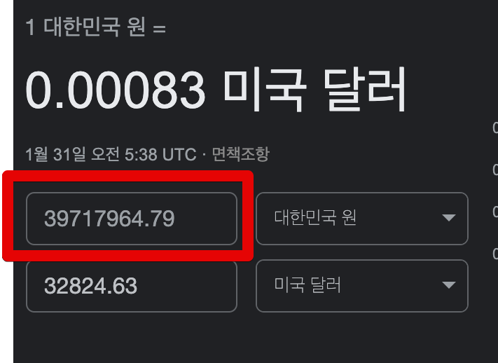
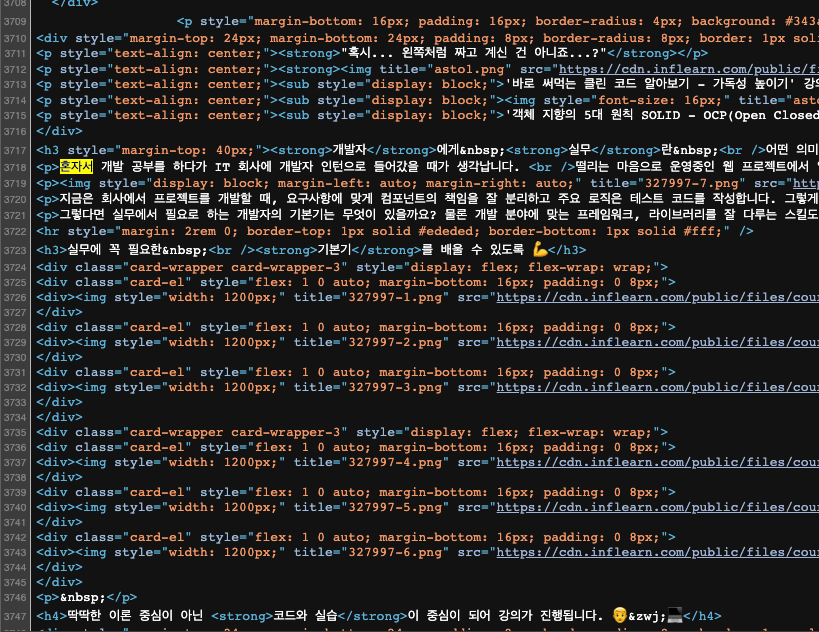
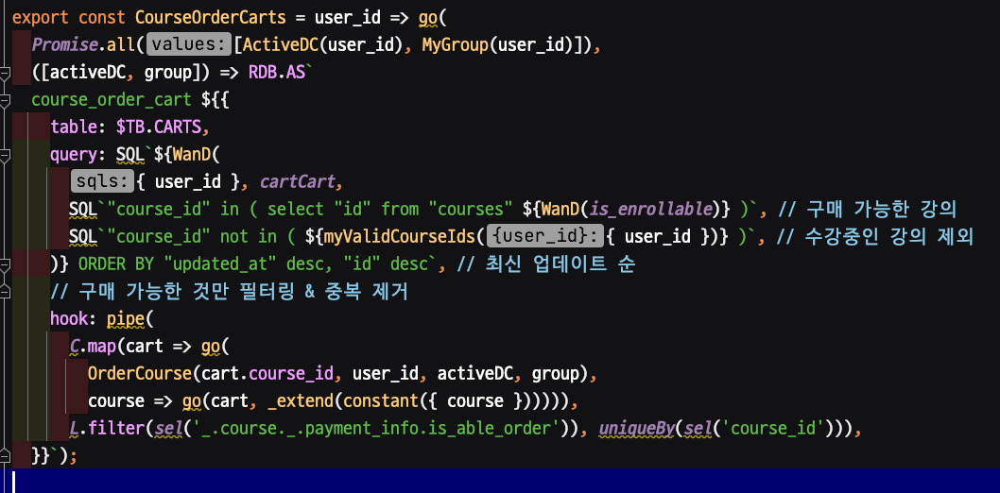
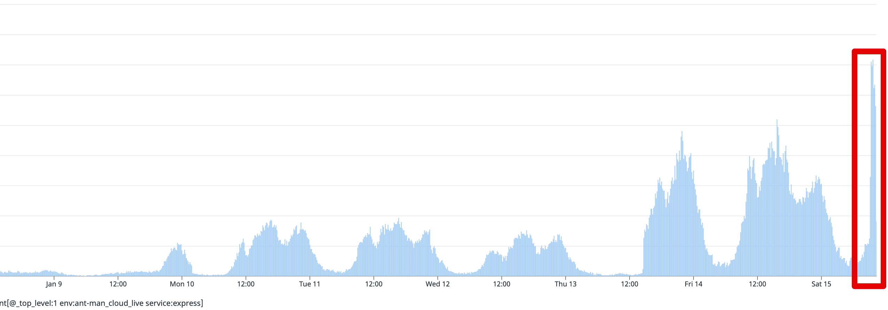
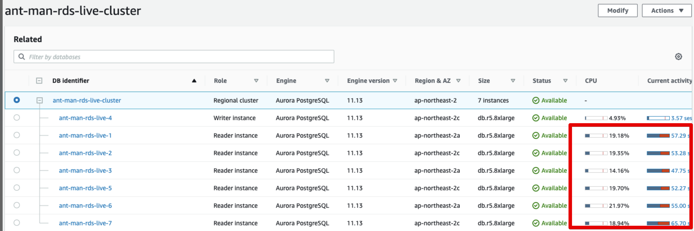

# 2022년 1월 100% 할인 이벤트 장애 회고

안녕하세요 인프런의 향로입니다.  
인프런 서비스는 2022년 1월 3일 ~ 17일까지 지속적으로 서비스를 사용할 수 없는, 역대급 장애가 발생했습니다.  

이번 장애 기간동안 정말 많은 분들의 질책을 들으면서 반성을 했습니다.  
특히 퇴근 후 1~2시간 공부밖에 못하시는 분들께서는 그날의 학습을 모두 포기하게 되는 경험을 드리게 되어서 더욱 복잡한 마음이 들었습니다.  
  
이번 포스팅을 통해 왜 이렇게 오랜 기간 서버 장애가 발생했는지, 근본 원인이 해결 된 것은 맞는지 등의 의문을 해소하려고 합니다.  
  
이런 장애 부검은 앞으로도 지속적으로 유지하면서 인프런 서비스가 개선되고 있음을 투명하게 공유드리도록 하겠습니다.
  
> 다시 한번 서비스 사용에 불편을 드려 정말 죄송합니다.

# 1. 발단

2022년을 맞이해서 인프런에서는 [특정 강의를 100% 할인 이벤트](https://www.inflearn.com/pages/start-20220103)를 진행했습니다.  

다양한 분야의 **강의 125개**, **총 5,016,000원** 강의를 **모두 0원**에 아래 기간동안 등록할 수 있는 이벤트였습니다.

* 첫번째 이벤트: 2022년 1월 3일 (월) ~ 2022년 1월 17일 (월)
* 두번째 이벤트: 2022년 1월 18일 (화) ~ 2022년 1월 24일 (월)


이 이벤트는 저희의 예상을 벗어날정도로 엄청난 바이럴이 발생했는데요.


트위터에서만 **1만 리트윗이상**이 발생하고, 그 외 디시인사이드, 루리웹, 클리앙등 여러 IT 커뮤니티에서도 공유가 되어 **평소 대비 5~20배의 트래픽**이 발생했습니다.  
  
그 덕에 **7일만에 76,730의 신규 가입자**분들, 전년 대비 **1,855**%라는 놀라운 수치를 달성하기도 했습니다.


반면, 그만큼의 트래픽이 발생했기 때문에 장애가 지속적으로 발생했는데요.  
아래는 **시간별 트랜잭션수** 인데, 빨간박스가 평소대비 높은 수치를 달성한 시간이고 **모두 장애가 발생**하였습니다.


(1월 3일 ~ 1월 8일)


(1월 16일 ~ 1월 21일)  
    
이 수치는 그간 저희 서비스에서 겪지 못했던 수준이였고, 앞선 이벤트들에서도 만나지 못했던 수치였습니다.  
  
그러다보니 1월 3일, 4일, 7일, 17일 등 **총 4일 동안 오전 9시, 오후 10시**가 되면 서비스가 불가능한 상태가 되었습니다.    
  
단순하게보면 트래픽을 통한 서비스 장애라고 볼 수 있겠습니다.  
하지만 여기까지 보신 분들이라면 의아한 점이 몇가지 있으실텐데요.

* 아무리 폭증한 트래픽이라하더라도 쿠팡/배민 등에 비하면 작은 트래픽일텐데, 클라우드 서비스의 **스케일아웃/스케일업**도 안했었나?
* 이벤트 준비하면서 **성능 테스트**도 미리 안했나?
* 1월 8일 장애 이후 17일 장애까지는 10일간의 시간이 있는데, **그동안 대응안하고 뭐했나**?

각 타임라인을 보면서 이런 의문점에 대해서 하나씩 답변드리겠습니다.

> 저희의 면죄부를 이야기한다기 보다는, 하나의 작은 스타트업이 기술 부채로 인해 발생한 서비스 장애의 원인을 어떻게 찾고, 이를 해결하기 위한 임시 방안, 전반적인 근본 원인을 조사하는 과정을 소개드리는 것으로 생각해주시면 좋을것 같습니다.
 
# 2. 장애 회고

장애 회고에 대해 말씀드리기 앞서, 현재 인프런 서비스의 구조에 대해서 짧게 소개해드리겠습니다.

## 서버 구조


> Application Load Balancer, ElasticCache (Redis), DynamoDB, AWS Lambda 등도 사용중이지만, 이번 장애와는 무관하기 때문에 위 그림에서는 제외했습니다.

현재 인프런의 경우 **모놀리틱 NodeJS 프로젝트**를 ECS Fargate 에 올려 트래픽에 따라 **10대 ~ 30대**를 유지하고 있습니다.  
이번 장애와 직접적인 영향이 있는 데이터베이스의 경우 **AWS Aurora PostgreSQL 10.16**을 사용중인데요.  

* 1대의 쓰기 (Master) 
* 2 ~ 7대의 읽기 (Replacation) 

대부분의 조회용 쿼리는 읽기 DB를 통해 처리하고, 등록/수정/삭제의 요청들은 쓰기 DB를 통해 처리하면서 적절하게 DB 부하를 분산하고 있었습니다.  

> [Multi Master](https://aws.amazon.com/ko/blogs/korea/building-highly-available-mysql-applications-using-amazon-aurora-mmsr/) 의 경우 아직까지 고려하고 있지는 않습니다.  
> 애초에 서비스별로 별도 DB를 구성하는게 가용성과 성능에 더 효과적이라고 생각하기 때문입니다.

서비스별로 각자의 DB를 갖고 있지 않은 상태이기 때문에, **한 서비스의 장애는 전체 서비스의 장애**로 확장될 수 밖에 없는 구조입니다.  

> 물론 그렇기 때문에 MSA (MicroService Architecture)로 가야한다는 것이 이번 글의 핵심은 아닙니다.  

적절한 서버 대수 (10대 ~ 30대) 와 DB 부하 분산 (총 8대의 DB / Replication 구조) 가 되어있음에도 장애를 만나게 된 이유가 있는데요.   
  
위 내용을 기반으로 지난 1월 3일부터 1월 17일까지 발생했던 서버 문제를 살펴보며 어떤 상황이 발생하고 조치를 취했는지 정리해보겠습니다.

## 1월 3일 장애

이벤트 시작일인 2022년 1월 3일 저녁 8시부터 예상치 못한 규모의 접속량 증가가 발생했습니다.  
그로인해 **오후 8:30분부터 오후 10:00까지** 1시간 30분동안 서비스가 사용불가능할정도로 서비스 지연이 발생했습니다.  
  
이 기간동안의 문제는 **강의 페이지의 관심회사 조회** 기능에서 대량의 슬로우 쿼리가 발생했습니다.


([강의 페이지](https://www.inflearn.com/course/http-%EC%9B%B9-%EB%84%A4%ED%8A%B8%EC%9B%8C%ED%81%AC)를 가보시면 이 강좌를 듣고 있는 분들의 회사 정보를 볼 수 있습니다.)  

해당 조회 API는 실시간으로 가공해서 조회하다보니, 인덱스가 적용이 안된 경우 성능 부하를 줄 수 있는데요.  
해당 쿼리의 지연으로 인해 **빠르게 Node 프로세스의 커넥션이 고갈되어** 이후의 요청들이 모두 대기 상태로 빠지게 됩니다.  
그리고 일정 수치이상을 대기하다가 Node 프로세스들이 강제 종료되는 현상이 발생했습니다.  
ECS 설정을 통해 **빠진 프로세스만큼 다시 프로세스가 추가**되지만, 관심회사 조회 API 외에도 처리하던 **다른 쿼리도 Node 프로세스의 종료로 전부 Cancel** 되어 서비스가 전체적으로 사용이 불가능한 상태가 됩니다.  
  
관심 회사 조회 API의 쿼리중 일부가 인덱스가 적용 안된 것을 로그와 실행계획을 통해 확인후 바로 **인덱스를 추가**해서 이 문제는 일단락 시킬 수 있었습니다.  
  
그렇게 임시조치를 하고 대기중에 또다시 서비스 장애가 시작됩니다.  
앞서 장애로 서비스를 사용못했던 분들 + 본격적으로 퇴근하고 자기개발을 시작하신 고객분들이 함께 유입되기 시작했기 때문인데요.  
    
본격 트래픽이 유입되니 1월 3일 **오후 11:30분부터 1월 4일 새벽 01:30까지** 2시간동안 **쓰기 DB의 CPU가 90% 이상**이 되어 전체 서비스가 사용이 불가능했습니다.  
  


이번 장애의 경우 쓰기 DB의 부하로 인해 발생했습니다.  
  
이땐 2개의 문제가 겹치게 된 경우였습니다.  

* Redis의 부하를 낮추기 위해 DB로 분산시킨 캐시용 데이터
* 쓰기 DB에서 호출되던 조회용 쿼리

모든 캐시 데이터를 Redis에서 관리하면서 Redis의 부하 문제가 종종 발생했는데요.  
이 문제를 해소하기 위해 일부 캐시 데이터는 DB에서 관리하도록 구성하였습니다.  
  
다만, 초기 캐시 데이터 설계를 잘못하여 **1개 JSON에서 모든 캐시데이터를 관리** 하도록 되어있었습니다.  
그러다보니 DB로 캐시를 분리하는 것 역시 **1개 Row에 보관할 모든 캐시 데이터를 저장**하도록 구성하고 조금씩 개선할 예정이였는데요.    
  
그렇게 적재되던 고용량의 캐시 Row는 (단일건) 결국 캐시 초기화 / 캐시 재생성등의 행위가 발생할때마다 쓰기 DB에게 큰 부하를 주게 됩니다.  
  
평소에는 큰 문제가 없다가, 이번처럼 사용자수가 증가하여 캐시 초기화 & 재생성이 빈번하게 발생하는 경우 문제가 발생하게 되는데요.  
특히나 **1개 Row에 대한 요청이 겹치다보니 데드락**이슈로 확장되게 됩니다.


아직 **쓰기 DB에서 처리하는 조회용 쿼리**들의 호출수도 급격히 높아져 쓰기 DB의 부하를 더욱 심화시켰습니다. 

> 인프런의 경우 **Aurora DB 도입을 작년 여름**에 하여 쓰기 / 읽기 DB 쿼리 분산이 일부 쿼리에만 적용된 상태였습니다.  

서비스를 안정화시키는 것이 우선이기에, 당장 조치하기 어려운 캐시 데이터 해체보다는 아래 2가지 작업을 우선적으로 진행합니다. 

* 캐시 초기화 & 재생성 주기 변경
* 쓰기 DB에 부하를 준 조회용 쿼리들만 먼저 읽기 DB로 전환

이렇게 1월 3일의 장애를 일단락하고 퇴근을 하게 됩니다.

## 1월 4일 장애

1월 4일 오전 9시가 되자 다시 한번 트래픽이 증가하게 됩니다.  

> 1월 4일 역시 오전/오후 모두 장애가 발생했지만, 둘 모두 강의 테이블에 관련된 장애라 하나로 묶어서 설명드립니다.

오전 9시는 많은 분들이 강의 수강을 하는 시간대이다보니, 미리 출근해서 준비를 하고 있었는데요.  
1월 4일 오전9시부터 12시까지 총 **3시간동안** 서비스를 사용할 수 없게 됩니다.  
  
이때의 장애 원인은 **강의 조회 관련 슬로우 쿼리** 때문이였는데요.


(상위 9개의 슬로우 쿼리가 모두 강의 조회)  
  
인프런 내에서는 강의 테이블의 조회 쿼리가 굉장히 많습니다.  
실제 강의 검색 외에도 아래와 같이 **추천형 기능**들이 모두다 강의 테이블을 기반으로 하기 때문입니다.  


슬로우 쿼리의 종류가 워낙 다양하여, 한번에 모든 쿼리를 수정할수는 없다고 생각했습니다.   
그래서 당장의 문제를 해결하기 위해 **r5.8xlarge 8대**로 늘려서 시간을 벌려고 했는데요.  
  
이정도의 스펙은 **별도의 할인 없이 OnDemand** 로 계산한다면 **월 4천만원**을 데이터베이스 비용으로 쓰는것이였습니다.  
(물론 이 사양을 **한달동안 계속 유지**했을때입니다.)




하지만 이렇게 데이터베이스를 고스펙 X 대량증설을 해도 단지 몇십분 정도의 시간만 벌어주고, 실제 **장애 해소에는 전혀 도움이 되지 않았습니다**.  
  
그래서 모니터링상으로 나온 2가지 문제를 빠르게 수정하기 시작했습니다.

* 비효율적인 실행 계획
* 불필요한 조회항목들

> 이때의 해결책은 임시 조치에 가까우며, 실제 근본 원인은 마지막에 찾게 됩니다.

슬로우 쿼리들의 대부분은 **테이블의 컬럼을 변조** (`lower("컬럼명") = lower(쿼리파라미터)`) 하거나 부정조건 (`!=`, `NOT IN` ) 등 **인덱스를 사용할 수 없는 쿼리**들로 되어 있었습니다.  
  
그러다보니 테이블 풀 스캔 쿼리가 동시에 수십 ~ 수백개가 발생하면서 여러 병목의 원인이 되었습니다.  
  
이외에 **READ IO의 병목**을 주는 쿼리들도 있었습니다.  


일부의 슬로우 강의 조회 쿼리들을 보면 `select *` 로 되어있어 **사용 여부와 관계 없이 모든 컬럼을 조회**하도록 되어있었는데요.  
  
그러다보니 **사용하지도 않는 대용량의 컬럼들도 함께 조회**되었습니다.  
  
이를테면 아래와 같이 강의 본문의 경우 **엄청난 텍스트가 있는 컬럼**입니다.


이 컬럼은 **HTML 태그를 포함**해서 포함하다보니 아래와 같이 수많은 문자열이 포함되어있었습니다.



실제 용량을 측정해보면 해당 컬럼 1개의 값이 **10KB** 나 되는 고용량의 데이터였습니다.


이런 고용량의 컬럼을 **모든 강의 관련 쿼리에서 조회 항목에 포함**시켜서 가져오고 있었습니다.  
  
이 2가지 큰 문제들의 수정을 진행했습니다.

* 조회 쿼리 개선
  * 인덱스를 추가하거나 쿼리를 변경해서 인덱스를 사용하도록 개선
  * 개선이 안되는 쿼리라면 차라리 기능 OFF
* `select *` 로 조회되던 컬럼에서 고용량인 강의 소개 컬럼은 모두 제거
  * 실제 기능에서 사용되지 않던 컬럼

원인을 파악하고 문제가 되는 쿼리들을 정리하는데는 모니터링과 슬로우쿼리 알람을 통해 30분도 안되는 짧은 시간이 소요된 반면, **실제 해결까지는 3시간이 소요**되었는데요.  
  
이유는 **무분별한 쿼리 추상화** 때문이였습니다.  




(프로젝트에서 사용중인 쿼리들)  
  
모든 쿼리가 **함수 / Hook / 커스텀 이벤트**를 사용해서 구성하다보니 **해당 쿼리의 실제 코드를 찾는데 많은 시간을 소모**하게 됩니다.  
  
또한 기존 프로젝트에서는 **타입이 없고, 테스트 코드가 없다보니** 안정감을 가지고 조회 쿼리를 변경하기가 부담스러웠습니다.  
  
그래서 로컬에서 충분한 수동 테스트를 하고 나서야 실제 배포를 진행할 수 있었고, 그로 인해 **실제 장애 시간이 더 길어지게 되었습니다**.  
  
위 조치 사항을 진행하고, 서비스가 안정화 되는 것을 확인후 퇴근을 할 수 있었습니다.

## 1월 7일 장애 

1월 4일이 지나고 **1월 5일 & 6일에는 더이상 장애가 발생하지 않았습니다**.  
그래서 이젠 이벤트를 통한 장애 현상은 모두 해소되었다고 안심하게 되는데요.  

* [1월 3일, 4일 장애 해소 공지](https://www.inflearn.com/notices/385875)
  
정말 귀신 같이 안심하자마자 **1월 7일 저녁 9시부터** 여러 지연 현상이 발생하게 됩니다.


(출처: [인스타그램 경수님](https://www.instagram.com/p/CP1893vDg_y/))

1월 4일과 마찬가지로 이번에도 **강의 테이블의 쿼리**가 문제였는데요.  
  
이전과는 달리 이번에는 `where id in (ID)` 에 포함되는 **ID의 개수가 100개를 초과**해서 인덱스를 사용하지 못하고 테이블 풀 스캔을 하는 쿼리의 문제였습니다.


위 쿼리는 장바구니, 구매완료, 결제페이지 등에서 신청하는 강의들의 정보를 가져오는 쿼리입니다.  


(수강바구니)  
  
이 쿼리가 평소에는 문제가 없었지만, 이번 이벤트의 경우 **125개의 강의를 100% 할인**하기 때문이였는데요.  
**한번에 125개 강의를 모두 담아서 일괄 결제** (어차피 0원이니) 하는 수강생분들이 급증했기 때문입니다.  
  
이 문제를 해결하기 위해서 "한번에 담는 강의의 수를 제한" 보다는 `IN` 절에 담는 `ID`를 20개씩으로 끊어서 `Promise.all` 로 분할처리하도록 구성하여 `IN` 절을 통한 인덱스 효과를 다시 사용할 수 있도록 하였습니다.     
  
이렇게 첫 주의 할인 이벤트가 마무리 됩니다.

## 1월 17일 장애 (최종)

첫 주의 할인 이벤트가 끝나고, 1월 17일부터 시작되는 두번째 이벤트를 맞이하기 위한 준비를 시작하게 됩니다.  
  
이때 정말 어려웠던 것이 **성능 테스트를 할 수 없다**는 것이였는데요.  
  
선착순 할인, 선착순 쿠폰 등 **특정 페이지, API에서 트래픽이 예상**되고, 이를 성능 테스트하는게 일반적인데요.  
첫 주의 이벤트 장애를 회고해보면 **어느 페이지가 문제가 될지 전혀 예상 할 수가 없었습니다**.  
(강의소개, 추천강의, 메인페이지, 수강바구니, 결제페이지, 관심회사 등)  
  
당연하게도, 인프런의 대부분의 페이지가 트래픽이 몰리면 언제든 장애가 날 수 있는 시한폭탄같은 상황이였던 것입니다.  
  
가장 예상되는 지점이 **강의 테이블**인건 명확하나, 이미 수많은 기능들이 이 강의 테이블과 `JOIN`, `SubQuery` 등으로 되어있어 별도의 데이터베이스로 분리하는 작업을 일주일안에 수행할 순 없었습니다.  
  
그래서 **보편적인 성능 개선**을 진행합니다.

* PostgreSQL 버전 업데이트 (10.16 -> 11.13)
  * [B Tree Index 성능 개선 및 B Tree Index 커버링 인덱스 효과](https://jojoldu.tistory.com/630)를 위해
* 쿼리 타임아웃 설정 (5초)
  * 5초이상 수행되는 쿼리라면 강제종료하여 Long Query 사전 차단
* Max Connection 증설
* 현재 **2초 이상 수행되는 쿼리**들에 대한 성능 개선

이렇게 대응후, **1월 15일 토요일 오전 9시**가 되었습니다.  
이 시간대는 해당 주의 가장 많은 트래픽이 발생했는데요.  
(첫 주 이벤트 당시 요청수와 비슷한 수치)



그럼에도 서비스에 전혀 이슈가 없었습니다.  
그래서 문제가 해결되었구나 라는 생각을 하고 장기 개선 계획만 세우고 있었습니다.  
  
하지만 애석하게도 본격 이벤트가 시작된 **1월 17일 오후 10시**가 되자마자 RDS의 여러 수치가 요동치기 시작합니다.



오후 10시 30분, 서비스가 사용 불가 상태가 됩니다.

### 근본 원인 분석

1월 17일 장애는 저에게 한가지 큰 의문을 남겼는데요.  
**1만건도 되지 않는 강의 테이블만을 탐색**하는 쿼리에서도 슬로우가 발생한 것입니다.  
  
저는 전직장에서 10억건이 넘는 테이블에서도 인덱스 설계를 통해 1~2초 쿼리가 수행되는 것을 경험했는데요.  
아무리 생각해도 1만건도 안되는 단일 테이블만 조회하는 쿼리에서도 슬로우가 발생한다는게 이해가 안되었습니다.  
  
그러던 중, 혹시나 하는 마음으로 **쓰기 DB의 테이블 Tuple** 정보를 확인해봅니다.

```sql
SELECT
    n.nspname AS schema_name,
    c.relname AS table_name,
    pg_stat_get_live_tuples(c.oid) + pg_stat_get_dead_tuples(c.oid) as total_tuple,
    pg_stat_get_live_tuples(c.oid) AS live_tuple,
    pg_stat_get_dead_tuples(c.oid) AS dead_tupple,
    round(100*pg_stat_get_live_tuples(c.oid) / (pg_stat_get_live_tuples(c.oid) + pg_stat_get_dead_tuples(c.oid)),2) as live_tuple_rate,
    round(100*pg_stat_get_dead_tuples(c.oid) / (pg_stat_get_live_tuples(c.oid) + pg_stat_get_dead_tuples(c.oid)),2) as dead_tuple_rate,
    pg_size_pretty(pg_total_relation_size(c.oid)) as total_relation_size,
    pg_size_pretty(pg_relation_size(c.oid)) as relation_size
FROM pg_class AS c
JOIN pg_catalog.pg_namespace AS n ON n.oid = c.relnamespace
WHERE pg_stat_get_live_tuples(c.oid) > 0
AND c.relname NOT LIKE 'pg_%'
ORDER BY dead_tupple DESC;
```

그리고 **강의 테이블의 Dead Tuple**이 99%가 된 것을 볼 수 있었습니다.  


`autovacuum` 이 강의 테이블에서 수행중일텐데, Dead Tuple이 아직 99% 인게 이상하다는 생각이 들어 수동으로 `vacuum` 을 수행해 Dead Tuple을 처리합니다.  
  
그리고 혹시나 싶어 Dead Tuple Rate를 모니터링 했는데요.  
**엄청나게 빠른 주기로 Dead Tuple Rate가 증가**하는 것을 확인할 수 있었습니다.  
  
그리고 빠르게 강의 테이블에서만 Dead Tuple Rate가 올라가는 이유 역시 모니터링을 통해 발견하였습니다.


강의 테이블에서는 **수강생 수를 컬럼으로 관리**하고 있었습니다.  
수강생이 강의를 등록하면 **수강생 수 항목을 +1을 시키는 Update** 쿼리가 수강 신청 이벤트가 발생하면 항상 수행되었는데요.  
  
이 기능이 결국 강의 테이블 병목의 근본 원인이였습니다.  
  
PostgreSQL 은 MVCC (Multi Version Concurrency Control) 을 위해 튜플 개념이 존재합니다.  
기존의 다른 RDBMS (ex: MySQL) 처럼 해당 데이터가 `UPDATE`, `DELETE` 를 한다고 해서 실제 데이터를 수정하거나 삭제하지 않습니다.  
수정 이벤트 발생시 기존 데이터는 **변경되었다는 표시를 남기고**, 새로운 데이터를 기록합니다.  
  
기존 데이터를 변경하지 않고 보관하는 방식을 택하다보니, `UPDATE`, `DELETE`, `Transaction` 이벤트가 많아질 수록 Dead Tuple 발생에 따른 디스크 I/O 증가가 성능 저하를 일으키게 됩니다.  

* [a-beginners-guide-to-postgresqls-update-and-autovacuum](https://www.cybertec-postgresql.com/en/a-beginners-guide-to-postgresqls-update-and-autovacuum/)
  
특히나 강의 테이블의 경우 고용량의 컬럼들 (**강의 소개 컬럼의 HTML 코드**)로 인해 Dead Tuple 하나 하나의 용량이 굉장히 높은데요.  
그러다보니 **잦은 업데이트 쿼리는 고용량의 Dead Tuple 를 대량으로 생산** 으로 이어지게 됩니다.  
  
정리하면, 

* 100개 이상의 강의를 일괄 등록하는 수강생분들의 폭발적인 증가
* **고용량의 컬럼**을 가진 강의 테이블의 **잦은 업데이트** 발생 
* 그로 인한 **Dead Tuple의 폭발적 증가** 로 모든 강의 테이블 쿼리들의 병목 현상
  
이 이번 이벤트 기간의 근본적인 장애원인이였습니다.  
  
그동안 모든 데이터베이스 병목이 **읽기 DB에서의 슬로우 쿼리**로 보여주고 있어 읽기 DB만을 모니터링 하던것이 근본 원인을 파악하는데 방해가 되었습니다.  
  
근본 원인을 파악하고 나니 해결은 굉장히 쉬웠습니다.  
결국 고용량의 컬럼과 수강생수 업데이트를 분리하면 되는 것인데요.

기존의 다른 기능들의 영향도를 파악해서 **수강생수 컬럼을 분리하기 보다는 강의 소개 컬럼을 분리**하는 것을 선택했습니다.  
  
이렇게 고용량을 가진 강의 소개 컬럼을 별도의 테이블로 분리하고나서는, **이벤트로 인한 장애는 더이상 발생하지 않았습니다**.

# 마무리

> 다시 한번 해당 기간동안 서비스 장애를 경험하신 모든 수강생분들께 죄송하다는 말씀 드립니다.

이번 이벤트 장애는 인프랩 개발팀에게 많은 숙제를 안겨주었습니다.  

* 모든 영역에서의 높은 장애 민감도
* 한 테이블의 장애가 전체 서비스의 장애로 확장 되는 구조
* 성능 개선이 쉽지 않은 테이블, 캐시 구조
* 직관적이지 않은 SQL 코드
* 안정감을 주지 못하는 코드 (Typeless, 테스트코드의 부재 등)
* 안정적인 Batch 환경의 부재
* 아직 밝혀지지 않은 수많은 숨겨진 장애 포인트

인프런 서비스는 하나의 거대한 모놀리틱 NodeJS 프로젝트로 만들어지고 3년이 지났습니다.  
그러다보니 모든 스타트업이 겪는 기술 부채를 이제 본격적으로 경험하기 시작했습니다.  
그리고 올해부터 이 문제들을 하나씩 풀어나가려고 합니다.  
  
아마 일부의 문제들을 보시면서 MSA를 바로 떠올리실 분들도 계실텐데요.  
지금의 인프랩에서는 MSA에 대해 이야기하기에는 섣부른 감이 조금 있습니다.  
**조직의 구조와 성숙도가 충분히 갖춰지지 않은 상태**에서 MSA 전환을 시도하다가 망한 스타트업을 정말 많이 봤기 때문인데요.  

> 배달의 민족은 [수백명의 개발자분들이 모여서 3년간 (2016 ~ 2019년) 진행](https://www.youtube.com/watch?v=BnS6343GTkY) 해서 하나의 거대한 모놀리틱 프로젝트를 MSA로 전환하였습니다.  
이를 경험한 입장에서도 무작정 현재의 인프런에 MSA가 최선책이라고는 생각하지 않습니다.

조직의 구성과 성숙도가 충분하지 않은 경우 MSA는 높은 복잡도로 인해 오히려 더 큰 문제를 일으키게 됩니다.  
  
그래서 적정선의 모놀리틱을 유지하면서 **장애 전파율이 높은 일부 도메인을 별도로 분리해서** 조직의 구성에 맞게 **적정 수준에서 경계를 두고** 속도 조절을 할 예정입니다.  
    
물론 어느 순간 조직의 구조와 성숙도가 충분히 높아진 경우 그때 MSA로의 천명을 이야기할 수 있지 않을까 생각합니다.  
  
그리고 이런 개선 과정들을 계속해서 기술 블로그를 통해 공유드리면서 함께 성장하는 서비스가 되도록 노력하겠습니다.  
  
> 인프랩에서는 이런 문제를 함께 풀어갈 사람을 언제나 기다립니다.
[채용 공고](https://inflab.notion.site/inflab/d96215b0d4d44f62ba65c88120c999c5)


